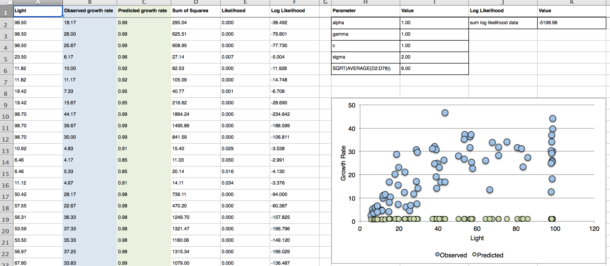
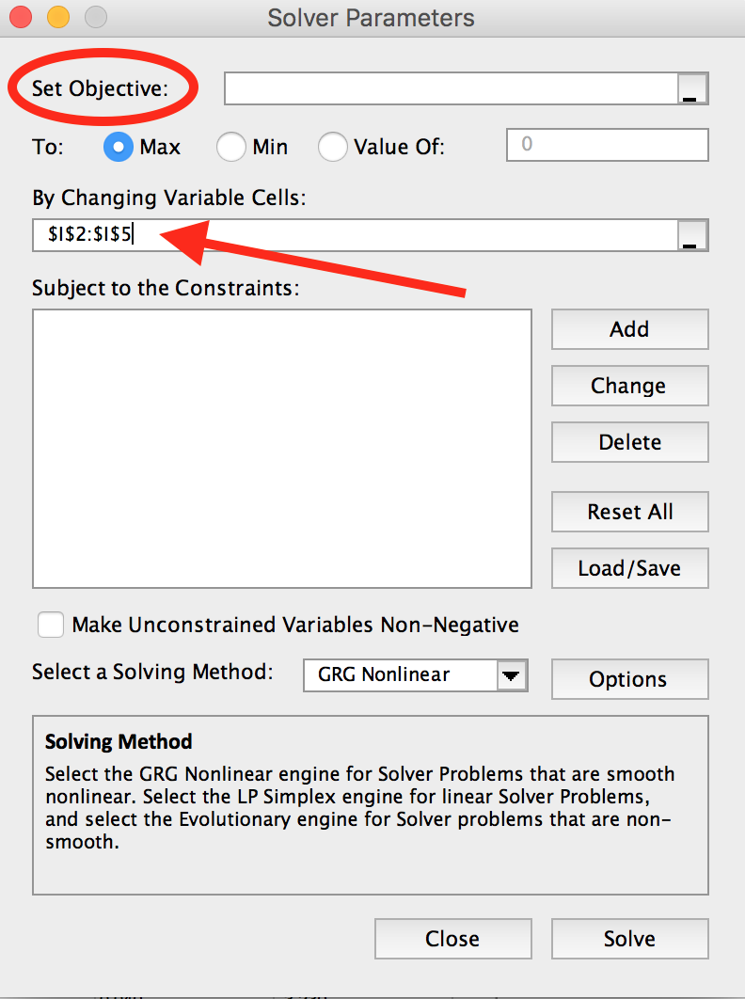

<script type="text/x-mathjax-config">
MathJax.Hub.Config({
  TeX: { 
      equationNumbers: {
 
            autoNumber: "all",
            formatNumber: function (n) {return +n}
      } 
  }
});
</script>

---
output: html_document
---


### `r fileName="../Title.txt";readChar(fileName,file.info(fileName)$size)`
#### Estimating Model Parameters Using Maximum Likelihood 
#### `r format(Sys.Date(), format="%B %d, %Y")`

- - -
#### Table of Contents

[I. General approach][]

[II. Problem][]

[III. Getting started][]

[IV. Using Solver][]

[V. Using R to do the same thing][]

[VI. Incorporating prior information in an MLE][]

[VII. References][]

```{r preliminaries, include = FALSE}
rm(list = ls())
library(knitr)

knitr::opts_chunk$set(cache = FALSE, warnings = FALSE, tidy = FALSE)

set.seed(5)
```

<br>

#### I. General approach

To get the most out of this lab, you must think of the specific problems you confront here as examples from an infinite variety of analytical challenges that can be attacked using the same general approach:

* Think about how the data arise.
* Develop a mathematical model of the process that produces the data.
* Choose the appropriate likelihood function to tie the predictions of your process model to the data. 
* Use maximum likelihood (in this exercise) or Bayesian methods (later) to estimate the parameters in your process model and associated uncertainties.
* In this exercise we will not attempt to distinguish among different sources of uncertainty, i.e., process variance, observation error, and random effects.  These distinctions will be made soon enough, after we have developed a bit more statistical sophistication.  Moreover, we are leaving the problem of model selection until later in the course.

<br>

#### II. Problem

Coates and Burton (1999) studied the influence of light availability on growth rate of species of conifers in northwestern interior cedar-hemlock forests of British Columbia.  They used the model, 
$$\mu_{i}=\frac{\alpha\big(L_{i}-c\big)}{\frac{\alpha}{\gamma}\big(L_{i}-c\big)},$$

where:

$\mu_{i}$ = prediction of growth rate of $i_{th}$ hemlock tree (cm/year)

$\alpha$ = maximum growth rate (cm/year)

$\gamma$ = slope of curve at low light (cm/year)

$c$ = light index where growth = 0 (unitless)

$L_{i}$ = measured index of light availability for the $i_{th}$ hemlock tree, i.e. the proportion of the hemisphere above canopy open to light $\times$ 100, unitless)

We will return to this model several times during the course.

<br>

#### III. Getting started

Obtain maximum likelihood estimates (MLE’s) of the model parameters using Solver in Excel. Ok, ok, you have invested buckets of time and effort learning R and now I am asking you to work in Excel?  What am I thinking?  There is a reason for this.  When you write code in R, it is easy to fail to understand exactly what is happening “under the hood.” The structure of a maximum likelihood analysis is much more transparent when you are forced to build a spreadsheet.

Open the spreadsheet that we provided containing the light limitation data (**HemlockLightLikelihood.xlsx**).  You want to add the proper formulas to columns and cells on the this sheet to demonstrate that you know how likelihood works.  Your final sheet will look something like this:



<br>

Let’s think about the columns and the rows.  This is the benefit of this exercise, so please linger on this, discussing the layout of this spreadsheet with your classmates and calling on the instructors if you don’t understand it. 

* Columns A and B should be easy, these are the data. 

* Column C contains the prediction of your model for each level of light. These predictions depend on the values for $\alpha$, $\gamma$, and $c$ contained in column I.

* Column D contain the squared difference between observations and predictions.

* Column E contains the likelihood, one value for each data point. Assume a normal likelihood function. The Excel formula for this is `=NORMDIST(B2,C2,sigma,FALSE)`.

<br>

Answer the following questions before proceeding.

1. What is the relationship between the formula in column E and the normal likelihood function (equation 2)?

$$
L\big(\,\mu_{i},\sigma \mid y_{i}\,\big)= \big[\,y_{i} \mid \mu_{i},\sigma\,\big] = \cfrac{1}{\sigma\sqrt{2\pi}}e^{-\cfrac{\big(y_{i}-\mu_{i}\big)^{2}}{2\sigma^{2}}}
$$

2. Describe the correspondence between $y_{i}$, $\mu_{i}$, and $\sigma$ in equation 2 and the columns and cells in your spreadsheet.  

3. What is the reason for the argument “FALSE” in the Excel formula in column E?  

4. What does the function return when that argument is “TRUE”? 

5. In your spreadsheet, where do you find the left hand side the normal likelihood function?  What is it, strictly speaking?

6. In column F we take the logs of the likelihoods, which are summed in cell K2.  If we had not taken the logs and instead, worked directly with the likelihoods, what formula would we use in K2?  

7. What are some potential computational problems with using the individual likelihoods rather than the log likelihoods to estimate the total likelihood? 

8. Make a plot of the data and the model predictions.  Adjust the model parameters by hand until you get a fit that looks reasonable in your plot.  This is what will be done in the next step, albeit with a bit more mathematical sophistication.

9. This model violates a fundamental assumption of traditional regression analysis.  What is that assumption?  How might you fix the problem? (Hint -- Think about what we are assuming about the covariate, light availability.)

<br>

#### IV. Using Solver

When you have your spreadsheet constructed, you will use Solver to find the maximum likelihood estimates of the parameters.  Solver is a very sophisticated non-linear numerical optimizer.  It searches for values of parameters of a function that maximize or minimize the output of the function.  

If you have never used Solver, the main dialog box looks something like this:
    
<br>

<div style="width:400px; height=300px; margin:0 auto;">

</div>

<br>

You will put the cell containing the sum of the log likelihoods in the **Set Objective** field.  The cells containing the parameter values will go into the **By Changing Variable Cells** field.  Most likely, you will be able to do the exercises without putting constraints on the parameter values if you give them reasonable starting values.  However, constraining parameters to reasonable values (e.g., α must be positive and can’t be too large) will prevent numerical errors and speed execution time.

10. How might you use the squared error column D to compute $\sigma$? Make this computation and compare with your maximum likelihood estimate of $\sigma$ obtained using Solver.

<br>

#### V. Using R to do the same thing

Check your results using the nls() function in R, which does non-linear estimation for normally distributed data. Examine the assumption that the model residuals are normally distributed using qqnorm.  To speed things along, I have given you the syntax, but for it to be useful to you, you must study it and experiment a bit.  In particular, you must do a help on nls and look at its methods—summary, predict, coef, and residuals.

```{r, eval = FALSE}
library(SESYNCBayes)
plot(HemlockLight$L, HemlockLight$g_rate, ylab = "Growth rate (cm/yr)", xlab = ("Light Availability"))

x = HemlockLight$L
y = HemlockLight$g_rate

model = nls(y ~ a * (x - c)/(a/s + x - c), trace = TRUE, start = c(a = 50, s = 2, c = 8))
summary(model)
p = (coef(model))
a.hat = p[1]
s.hat = p[2]
c.hat = p[3]
yhat = predict(model)

lines(x, yhat, col = "red")
```

<br>

#### VI. Incorporating prior information in an MLE 

Suppose that a previous study estimated $\alpha$ as 35 with a standard deviation of 4.25. Incorporate these prior data in your new MLE estimate of $\alpha$. Hint: create a likelihood function for the probability of the new value of $\alpha$ conditional on the previous value and its standard deviation. Take the log of this prior likelihood and add this to the log likelihood of the new value of α given the data. This produces a total log likelihood including the prior and current data. 

11. Describe what happens to the estimate of α relative to the one you obtained earlier. What is going on? 

12. What is the effect of increasing the prior standard deviation on the new estimate? What happens when it shrinks?

13.  There is a single log likelihood for the prior but the sum of many for the data. This seems "unfair."  Explain how the prior likelihood can overwhelm the data and vice versa.

<br>

#### VII. References

Coates, K.D., Burton P.J., 1999. Growth of planted tree seedlings in response to ambient light levels in northwestern interior cedar-hemlock forests of British Columbia. *Canadian Journal of Forest Research*, 1999, 29(9): 1374-1382, [10.1139/x99-091](http://northernforestatlas.com/research/pubs/burton_coates_1999_can_j_for_res.pdf)

