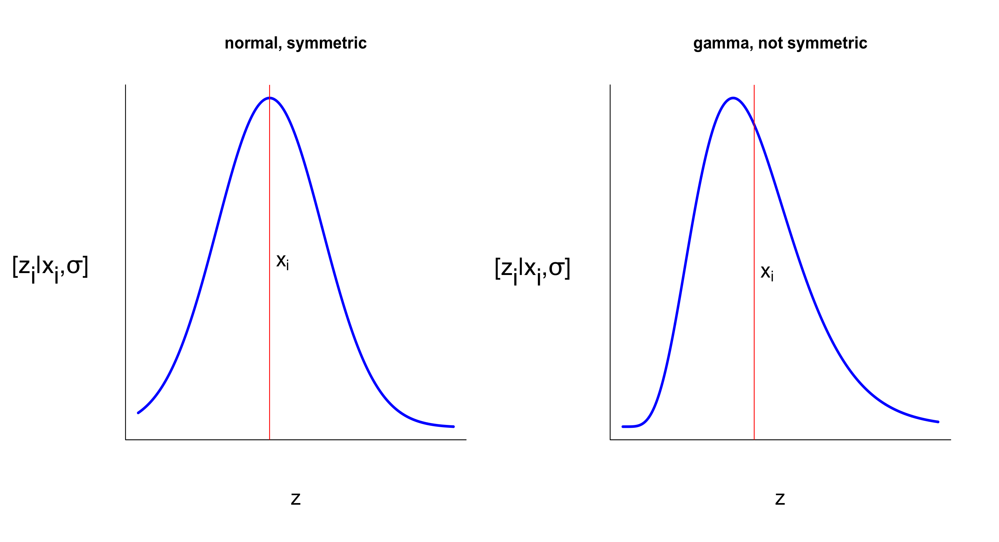

<style>

/* uncomment out this to generate exercise */
 .hider {display: none;}  
 .hider2 {display: inline;} 

/* uncomment out this to generate key */
/* .hider {display: inline;}  
/* .hider2 {display: none;}  

</style>

<script type="text/x-mathjax-config">
MathJax.Hub.Config({
  TeX: { 
      equationNumbers: {
 
            autoNumber: "all",
            formatNumber: function (n) {return +n}
      } 
  }
});
</script>

---
output: html_document
bibliography: bib.bib
---


### `r fileName="../Title.txt";readChar(fileName,file.info(fileName)$size)`
#### Metropolis Hastings Lab
#### `r format(Sys.Date(), format="%B %d, %Y")`

- - -

#### Table of Contents

[I. Introduction][] 

[II.  Overview of the MCMC algorithm][]

[III. The Metropolis step][] 

[IV. The Metropolis-Hastings step][]

[V. A toolbox for Metropolis-Hastings][]

[VI. The deterministic model][]

[VII. Data simulation][]

[VIII. Setup][]

[IX. The proposal function][]

[X. The prior function][]

[XI. The likelihood function][]

[XII. The choose function][]

[XIII. A few plotting functions][]

[XIV. Problem][]

[XV. Tuning][]

[XVI. References][]

```{r preliminaries, include = FALSE}
rm(list = ls())
library(knitr)
knitr::opts_chunk$set(cache = FALSE, warnings = FALSE, tidy = FALSE)

# uncomment out this to generate key
# nokey = FALSE; key = TRUE

# uncomment out this to generate exercise
 nokey = TRUE; key = FALSE

set.seed(3)
```

<br>

#### I. Introduction

The purpose of this lab is to learn how the Markov chain Monte Carlo (MCMC) algorithm approximates the marginal posterior distribution of parameters using accept-reject sampling.  This method is implemented using the Metropolis or Metropolis-Hastings algorithms. Accept-reject sampling is critical in ecology and social science because many of our most important models are non-linear. In these cases, Gibbs steps, which you used in the previous lab, will not work.

Your goal is to write math, code, and explanatory text, facing some important moments of struggle. We have provided a set of tested, general functions that can be easily modified for different problems. The functions are not intended to be a bullet-proof package, but rather a general framework for implementing the MCMC sampling that can be tweaked to work for a broad range of problems. The functions in the toolbox provide a nice pedagogical construct for linking math, code, and concepts by creating a point of focus for different steps in the Metropolis or Metropolis-Hastings algorithm using the light limitation of trees problem (from the likelihood lab) as an example.

As an added benefit, the functions offer a reasonable illustration of structured programming. This is a powerful approach that systems engineers and professional programmers rely on---breaking all problems into a series of relatively small, tested functions and then assembling the functions to complete the overall task. If you find yourself writing a hundred lines of code without structuring your work into functions, then you are almost guaranteed to encounter nasty bugs.

<br>

#### II. Overview of the MCMC algorithm

We covered MCMC sampling in lecture and it would be good to have your notes open as you work through this handout. You need to begin by writing out the model and dissecting the full model into a set of univariate conditional distributions. The marginal posterior for each conditional distribution is estimated using the MCMC algorithm, as follows.

1. Set up a structure to store a “chain” of values for each parameter in a model. We like a list of arrays for this purpose but any multi-dimensional structure will do.

2. Pick a sensible starting value for each parameter and store it as the first element in each chain.

3. Choose an approach for sampling from the posterior distribution of each unobserved quantity.  Exploit conjugate relationships whenever possible to allow *direct* sampling from the posterior.  Otherwise use accept-reject methods like Metropolis or Metropolis-Hastings.

4. Choose a parameter to estimate first (any one will do). Assuming that all of the other parameters are known and constant, make a random draw from the posterior distribution of this parameter using its conditional distribution. Store that draw. Repeat this process for all of the parameters you seek to estimate, including those that quantify uncertainty.

5. When draws have been made from the posterior distribution of all parameters, go back to step 4. Repeat this process many times until the chains provide converged estimates of the shape of the posterior distribution. Estimates that have converged display a posterior distribution that is not altered by taking more samples.  Throw away the part of the chain that has not converged.

6. Use the converged chains to make inferences by calculating moments, densities, quantiles etc.

<br>

#### III. The Metropolis step
 
An MCMC algorithm is composed of a series of steps. In each step, we make a draw from the full conditional distribution of an unobserved quantity, assuming all other unobserved quantities are known and constant. After many iterations these draws create a vector for each unobserved quantity. This vector(s) is used to make inference. In the previous lab where conjugate relationships were present, you used Gibbs steps to estimate a mean and a variance of normally distributed data.  Since conjugates are not always present, you will also need to know how to use accept-reject sampling associated with the Metropolis algorithm. 

Below we have summarized the series of and we refer to all unobserved quantities as "parameters." 

1. The chain for the parameter is defined as $\textbf{x}$ of length $n$. The first element in the $\mathbf{x}$ vector $\big(x_{1}\big)$ is known because we assign it with the initial conditions. Although not usually a critical decision, it is important to pick something that is clearly within the support---for example a negative integer for a parameter representing a survival probability would be a strange choice. 

2. We need a proposal distribution, from which we will draw new **potential** values of $x$. A proposal distribution is defined as: $$\big[z \mid x_{i}, \sigma \big] \textrm{,}$$ a probability density function for continuous parameters (or a probability mass function for discrete parameters) specifying the distribution for the new value $z$, conditional on the current value of $x$, and a tuning parameter, $\sigma$ (Note: for the Metropolis algorithm to work, these distributions must be symmetric). The tuning parameter optimizes for efficiency (how quickly the chain samples the parameter's posterior distribution). Most likely, even if your tuning parameter is defined sub-optimally everything will work (eventually). How we choose values for $\sigma$ will be discussed later. The mean of the proposal distribution is centered on the current $x_{i}$ value---remember you may need to translate the mean and $\sigma$ into shape parameters appropriate for the proposal distribution. In summary, the mean of the proposal distribution is $x_{i}$, and the parameter $\sigma$ determines how close the proposed new value, $z$, is likely to be to $x_{i}$. 

<br>
<div style="width:800px; margin:0 auto;">
<center>

Figure 1.  We draw a proposed new value $z_{i}$ from a proposal distribution centered on the current value $x_i$.
</center>
</div>
<br>

3. Starting with the first value in the chain, $i=1$, we make a random draw from $\big[z_{i} \mid x_{i},\sigma\big]$.

4. Now we decide which value should be kept in the chain (i.e., become $x_{i+1}$), the old value $\big(x_{i}\big)$ or the shiny new one $\big(z_{i}\big)$. As explained in lecture, we do that with the ratio of the likelihoods multiplied by the priors for each of the two alternatives, $x_{i}$ and $z_{i}$, $$R_i=\cfrac{\big[\textbf{y}\mid z_{i}\big] \big[z_{i}\big]} {\big[ \textbf{y} \mid  x_{i} \big] \big[x_i\big]}.$$ We keep $z_{i}$ (i.e. $x_{i+1}=z_{i}$) with probability $\min \big(R_i,1\big)$ and we keep $x_i$ (i.e. $x_{i+1}=x_i$) with probability $1-\min\big(R_i,1\big)$. When $R_{i} < 1$, you will need to generate a random draw from a uniform distribution defined on (0,1) and compare that value to $R_i$ to accept or reject the proposed value.  

    In practice we will often use this form instead (why?): $$R_i = \exp\big( \log\big(\big[\mathbf{y} \mid z_i\big] \big[z_i \big]\big) - \log\big(\big[\mathbf{y} \mid x_i\big] \big[x_i\big] \big)\textrm{.}$$ 

5. Increment $i$ until a large number of samples have been chosen. Return to step 3.  

6. Use the samples collected after the chain has converged to make inferences about parameters and derived quantities.

    Students often ask, "Why is $z$ chosen probabilistically? Why is it possible to choose $z_{i}$ when $R_{i} < 1$?" 

    Failing to do this can cause the chain to get "stuck" on a high probability value of $x_{i}$, preventing us from learning about the shape of the distribution. Keep in mind: $\big[\textbf{y} \mid z_{i}\big]$ and $\big[\textbf{y}\mid x_{i}\big]$ are likelihood functions using *all* of the data.  The likelihood functions may not be the same form as the proposal distribution, $\big[z \mid x_{i}\big]$. **Also**, we usually need a model to "get the parameter into the likelihood," that is, to make predictions that can be evaluated against data. If our ecological model is $g(\boldsymbol{\theta})$, then the Metropolis acceptance ratio will be: $$R_{i}=\cfrac{\big[\textbf{y}\mid g\big(z_{i}\big)\big] \big[z_{i}\big]}{\big[\textbf{y} \mid g\big(x_{i}\big)\big] \big [x_{i}\big]} \textrm{,}$$ where we are estimating one of the parameters in $\boldsymbol{\theta}$ and the others remain constant. If there are independent variables, these are implicitly included in $g\big(\boldsymbol{\theta}\big)$.

<br>

#### IV. The Metropolis-Hastings step

There is an important caveat about the Metropolis algorithm: the proposal distribution must be symmetric, which means that: $$\big[z_{i} \mid x_{i},\sigma\big] = \big[x_{i} \mid z_{i},\sigma\big]\textrm{.}$$ Therefore, if the current value of the chain is $x_{i}$, the probability of drawing $z_{i}$ is equal to the probability of drawing $x_{i}$ if the chain is located at $z$.

<br>

---

**Exercise:** 

1. Calculate the probability density of random variable $z = 10$, from a normal distribution with mean $\mu=x_{i}=12$ and standard deviation $\sigma=1.5$. Now calculate the density of a normally distributed random variable $x_{i}=12$ with mean $\mu=z_{i}=10$ and standard deviation $\sigma=1.5$. Repeat this calculation for a gamma distribution (using moment matching, of course).

2. Which distribution is symmetric?

3. Think of another proposal distribution that is symmetric and one that is asymmetric. Could you use the Poisson for a proposal distribution for parameters that are continuous?

4. What would be the problem with doing so? An important point---just because a distribution appears to be symmetric (shaped like a normal) doesn't mean that it is.  It must satisfy equation 5.

---

<br>

Although there are many cases when a symmetric proposal distribution works, we run into problems if the distribution includes values that are not defined for the parameter, as will be the case with a normal proposal distribution if our parameter is strictly positive. In that case, we can make a draw from the normal, exponentiate it to keep it positive, and use Metropolis (fondly known to students at CSU as the *Hooten shuffle*).

Hastings (1970) showed that a very small adjustment to the calculation of $R_{i}$ relaxes the assumption that proposal distributions are symmetric. In the Metropolis-Hastings algorithm, we use: $$R_{i}=\cfrac{\big[\textbf{y}\mid z_{i}\big] \big [z_{i}\big]}{\big[\textbf{y}\mid x_{i}\big]\big[x_{i}\big]}\cdot Q_{i}\textrm{,}$$ where $$Q_{i} = \cfrac{\big[x_{i}\mid z_{i},\sigma\big]}{\big[z_{i} \mid x_{i},\sigma\big]}\textrm{,}$$ and use the same decision process to decide on the value of $x_{i+1}$. Be sure that you understand that the quantity $Q_{i}$ is the ratio of the *probability densities* (or probabilities for discrete parameters) returned by these two distributions and is **not** a new draw from the distributions.

We suggest using Metropolis-Hastings for everything where Gibbs steps can't be used. When the proposal distributions are symmetric: $$\cfrac{\big[x_{i}\mid z_{i},\sigma\big]}{\big[z_{i} \mid x_{i},\sigma\big]}=1\textrm{,}$$ reducing the algorithm to Metropolis. By using Metropolis-Hastings for all proposal distributions, symmetric and asymmetric, you can have one set of code that applies in a general way to many problems, without having to worry about forgetting to include $Q$ for asymmetric distributions.

<br>

#### V. A toolbox for Metropolis-Hastings

Recall code from the light limitation of trees problem that you worked on in the likelihood lab. The deterministic model is $$\mu_{i}=g\big(\alpha,\gamma,c, L_i\big)=\cfrac{\alpha\big(L_i-c\big)} {\cfrac{\alpha}{\gamma} + \big(L_i-c\big)}\textrm{.}$$ We want to approximate the marginal posterior distributions of the parameters $\alpha$, $\gamma$, $c$, and $\sigma$---all of which are continuous and strictly positive. The growth rate is a real number that can be positive or negative. We have no prior knowledge of any parameter.  Note: the light level for the $i_{\textrm{th}}$ tree is notated as $L_i$.  We are assuming it is observed without error. The posterior and joint distribution is: $$\big[\alpha, \gamma,c,\sigma\mid \textbf{y}\big]\propto\prod\limits _{i=1}^n\big[y_i\mid g\big(\alpha,\gamma,c,L_i,\big),\sigma \big]\big[\alpha\big] \big[\gamma\big] \big[c\big] \big[\sigma\big] \textrm{.}$$

A bit of rationale: you could estimate these parameters in a quick snap with one line of code in R using the ``nls`` function in R. Why bother with the pain of doing it by MCMC: because you can use MCMC for problems that would swiftly bring `nls()` to its knees. In the spirit of walking before running, we will learn MCMC using a simple model, but our learning will allow us to analyze much more complex ones that can be solved virtually no other way. Moreover, as you will see, we will estimate the posterior distribution of some derived parameters, an impossible task with canned routines like ``nls``. Finally, the last time I checked, there was no easy way to get confidence bands on the predictions from ``nls``.

---

**Exercise:** 

1. What is a reasonable distribution for the 

  - likelihood? 
  
  - priors? 
  
  - proposal distribution? 

2. Write the full conditional distributions for all of the parameters.

---

Study the code for the functions below. Your challenge will be to use these functions to construct a MCMC algorithm using Metropolis-Hastings steps.

<br>

#### VI. The deterministic model

Just to save you time, here is a function you may use for the deterministic model.

```{r echo = TRUE, include = TRUE, message = FALSE}
g = function(alpha, gamma, c, L){
	mu = alpha * (L - c) / (alpha/gamma + (L - c))
	return(mu)
}
```

<br>

#### VII. Data simulation

The function ``get_data(alpha, gamma, c, sigma)`` simulates data for a given set of parameter values, plots the data, and does a non-linear least squares fit. 

Why not use the real data that you used in the likelihood lab? 

Because you want to know the answer when you are learning new methods for obtaining answers. **Always** simulate your data. Here is a function to do just that:

```{r echo = TRUE, include = TRUE, message = FALSE}
getData = function(alpha, gamma, c, sigma){
  set.seed(4)
	par(mfrow=c(1, 1))

	L = sort(runif(50, min = 12, max = 100))
	mu = g(alpha = alpha, gamma = gamma, c = c, L = L)
	y = rgamma(length(mu), mu^2/sigma^2, mu/sigma^2)
	plot(L, y, pch = 16, cex = 1.4, col = "blue")
	lines(L, mu, lwd = 2)

	model = nls(y ~ g( alpha = alpha, gamma = gamma, c = c, L = L), start = list(alpha = 50, gamma = 4, c = 2))
	s = summary(model)
	p = coef(model)
	y.hat = g(alpha = p[1], gamma = p[2], c = p[3], L = L)

	lines(L, y.hat, col = "red", lwd = 2)
	legend(40, 18, c("Generating values", "NLS fit"), lty = c("solid", "solid"), col = c("black", "red"), 
	  bty = "n", lwd = 2)

	return(list(
	  x = L, 
	  y = y, 
	  nls.alpha = p[1], 
	  nls.gamma = p[2], 
	  nls.c = p[3], 
	  nls.sigma = s$sigma, 
	  gen.alpha = alpha, 
	  gen.gamma = gamma, 
	  gen.c = c,
	  gen.sigma = sigma))
}
```

<br>

#### VIII. Setup

The function ``setup`` creates storage structures for the parameter chains, sets the first value in each chain, and sets the tuning parameters. The body of the function must be edited to choose initial values and tuning values. 

```{r echo = TRUE, include = TRUE, message = FALSE}
setup = function(n.iter, n.chain, parameter.names, dim.x){
	# Set up storage for chains
	x = list()
	for(i in 1:length(parameter.names)){
		x[[i]] = array(NA, dim = c(dim.x[i], n.iter, n.chain))
	}

	# Assign parameter names to elements of the list
	names(x) = parameter.names
	
	# Enter initial values for parameters here
	x$alpha[1, 1, 1] = 60 
	x$c[1, 1, 1] = 10
	x$gamma[1, 1, 1] = 3
	x$sigma[1, 1, 1] = 5 

	# Enter tuning parameters here
	tune=list(
	  alpha=10,
		c = 1,
		gamma=.3,
		sigma=2
	) 
	x$tune = tune
	return(x)
} 
```

It is called using the statement:

```{r echo = TRUE, include = TRUE, message = FALSE, eval = FALSE}
x = setup(n.iter = n.iter, n.chain = 1, parameter.names = c("alpha", "c", "gamma", "sigma",
  "y.hat", "growth_ratio"), dim.x = c(1, 1, 1, 1, n, 1))
```

This statement includes arguments for the number of iterations (`n.iter`), the number of chains, a vector of parameter names, and a list of the dimensions for both parameters ``("alpha","c","gamma","sigma")`` and derived quantities ``("y.hat", "growth_ratio")``  *in the same order as their names*. This list of dimensions is important for when we want to approximate a vector, as we will frequently want to do. For example, the argument ``n`` gives the number of data points and the number of predictions in the vector ``y.hat``.

The function returns a named list, `x`, of vectors for each parameter as well as a list of the tuning parameters for each parameter. To show this structure, set n.iter = 10, rather than the large number you would normally use for ``n.iter`` (5000 or more). The structure looks like this, omitting the bulky 50 x 10 matrix for ``y.hat``:

```{r, eval = FALSE}
> x = setup(n.iter = 10, n.chain = 1, parameter.names = c("alpha", "c", "gamma", "sigma", "growth_ratio"),
  dim.x = c(1, 1, 1, 1, 1))
> x
$alpha
, , 1

     [,1] [,2] [,3] [,4] [,5] [,6] [,7] [,8] [,9] [,10]
[1,]   60   NA   NA   NA   NA   NA   NA   NA   NA    NA


$c
, , 1

     [,1] [,2] [,3] [,4] [,5] [,6] [,7] [,8] [,9] [,10]
[1,]   10   NA   NA   NA   NA   NA   NA   NA   NA    NA


$gamma
, , 1

     [,1] [,2] [,3] [,4] [,5] [,6] [,7] [,8] [,9] [,10]
[1,]    3   NA   NA   NA   NA   NA   NA   NA   NA    NA


$sigma
, , 1

     [,1] [,2] [,3] [,4] [,5] [,6] [,7] [,8] [,9] [,10]
[1,]    5   NA   NA   NA   NA   NA   NA   NA   NA    NA


$growth_ratio
, , 1

     [,1] [,2] [,3] [,4] [,5] [,6] [,7] [,8] [,9] [,10]
[1,]   NA   NA   NA   NA   NA   NA   NA   NA   NA    NA


$tune
$tune$alpha
[1] 10

$tune$c
[1] 1

$tune$gamma
[1] 0.3

$tune$sigma
[1] 2

```

To understand this data structure, think about the parameter `alpha`, stored in `x$alpha`, which is an array with $1$ row, `n.iter` columns, and 1 "sheet." If we wanted 2 chains, there would be 2 "sheets," each consisting of $1$ row and `n.iter` columns. The strength of this approach is that it allows for vectors as well as scalars. So the prediction ``y.hat`` has 50 rows (one for each prediction), ``n.iter`` columns, and 1 sheet. We assign NA's to all of the elements of the chain except the first. If we wanted to get the $i^{\textrm{th}}$ value of the chain for the parameter alpha, we use ``x$alpha[1,i]`` or, equivalently, ``x$alpha[i]``. 

How would we get the $10^{\textrm{th}}$ value of ``sigma``? 

The setup function also sets initial values, tuning values (i.e., $\sigma$) for each of the parameters. These are guesses that can be changed. More about this later. 

<br>

#### IX. The proposal function

The function ``q()`` returns two types of values depending on the argument``type``. If ``type=="draw"`` then the function returns a random draw from the gamma distribution with mean ``mu`` and a standard deviation equal to the tuning parameter. When we use the function in this way, we make ``mu`` = the current value in the chain. If ``type=="density"`` then the function returns the density of ``theta``, which allows us to give the function the value of the proposal or the current value in the chain. Take a look at how the function is called and think about the relationship between the function call and the function definition. 

There are also arguments to the function that determine what kind of proposal you want---a real number that can take on negative or positive values, a non-negative real number, or a number between 0-1. You choose these based on the characteristics of the parameter you are estimating.

```{r echo = TRUE, include = TRUE, message = FALSE}
q = function(theta, mu, tune, type){
  sigma = tune
	if (type == "density") return (dgamma(theta, mu^2/sigma^2, mu/sigma^2))
	if (type == "draw") return (rgamma(1, mu^2/sigma^2, mu/sigma^2))
}
```

<br>

#### X. The prior function

The prior function provides flat, uniform priors on all of the parameters, returning probability densities on the log scale. You could make them informative by using the proper distribution and arguments. You could also choose other vague priors if you like by changing the distributions.

```{r echo = TRUE, include = TRUE, message = FALSE}
prior = function(param, theta){  
  if(param == "alpha") return( dunif(theta, min = 0, max = 500, log = TRUE))
	if(param == "c") return(dunif(theta, min = 0, max = 200, log = TRUE))
	if(param == "gamma") return(dunif(theta, min = 0, max = 200, log = TRUE))
	if(param == "sigma" ) return(dunif(theta, min = 0, max = 200, log = TRUE))
}
```

<br>

#### XI. The likelihood function

The likelihood function should resemble the one your wrote for the Bayes theorem lab.  There few things worth noting---you will need to modify this function if you want to use likelihood functions other than the normal, which will probably require the proper moment matching. Note the trick for preventing errors from infinite values, which can arise when a proposal produces a likelihood that is infinite or NaN. The function returns the log probability density of the output of the model conditional on all of the data.

```{r echo = TRUE, include = TRUE, message = FALSE}
Like = function(y, L, alpha, gamma,c ,sigma){
	mu=g(alpha = alpha, gamma = gamma, c = c, L = L)
	LogL = dnorm(y, mean = mu, sd = sigma, log = TRUE)
	return(sum(LogL[is.finite(LogL)]))
}
```

<br>

#### XII. The choose function

The choose function calculates the ratio of the posterior draw between the current value and the proposed value.  It also decides which one to keep using the algorithm we saw in lecture. Note exponentiating the difference between the logs of the likelihoods multiplied by the priors. 

Why is this a good idea rather than using the “un-log-ed" ratio?

```{r echo = TRUE, include = TRUE, message = FALSE}
choose = function(x, z, Like_z, Like_x, param, tune){
  # These are both logs so we add rather than multiply
  numerator = Like_z + prior(param, theta = z) 
  denominator = Like_x + prior(param, theta = x)
  q.ratio = q(theta = x, mu = z, tune = tune, type = "density") / 
    q(theta = z, mu = x, tune = tune, type = "density")
  # Because these are logs, we exponentiate the difference to get the ratio.
  R =  exp(numerator - denominator) * q.ratio
  if (R > runif(1, min = 0, max = 1)) new = z else new = x
  return(new)
}
```

Using the parameter ``gamma`` to illustrate, we call the ``choose`` function using:

```{r echo = TRUE, include = TRUE, message = FALSE, eval = FALSE}
choose(x = x$gamma[i - 1], z = z, Like_z = Like_z, Like_x = Like_x, param = "gamma", tune = tune$gamma)
```

<br>

#### XIII. A few plotting functions

To make life easier....

```{r echo = TRUE, include = TRUE, message = FALSE}
tracePlots = function(data, x, n.iter, burnin){
	par(mfrow = c(2, 2))
	plot(x$gamma[1,burnin:n.iter,1], type = "l", xlab = "Iteration", col = "chartreuse4", ylab = expression(gamma))
	abline(h = mean(x$gamma[1,burnin:n.iter,1]), col = "red")
	plot(x$alpha[1,burnin:n.iter,1], type = "l", xlab = "Iteration", col = "chartreuse4", ylab = expression(alpha))
	abline(h = mean(x$alpha[1,burnin:n.iter,1]), col = "red")
	plot(x$c[1,burnin:n.iter,1], type = "l", xlab = "Iteration", col = "chartreuse4",  ylab = expression(c))
	abline(h = mean(x$c[1,burnin:n.iter,1]), col = "red")
	plot(x$sigma[1,burnin:n.iter,1], type = "l", xlab = "Iteration", col = "chartreuse4", ylab = expression(sigma))
	abline(h = mean(x$sigma[1,burnin:n.iter,1]), col="red")
}

predictPlots = function(data, x, n.iter, burnin){
	par(mfrow = c(1, 1))
	q.y.hat = apply(x$y.hat[, burnin:n.iter, 1], 1, function(x) quantile(x, c(.025, .5, .975)))
	plot(data$x, data$y, xlab = "Light level", ylab = "Growth rate", main = "Prediction of growth rate",
	  pch = 16, cex = 1.4, col = "blue")
	lines(data$x, g(alpha = data$nls.alpha, gamma = data$nls.gamma, c = data$nls.c, L = data$x),
	  col="blue", lwd = 4)
	lines(data$x,q.y.hat[2,], col = "orange", lwd = 2)
	lines(data$x,q.y.hat[1,], lty = "dashed", col = "orange", lwd = 2)
	lines(data$x,q.y.hat[3,], lty = "dashed", col = "orange", lwd = 2)
	legend(40,18, c("Median", "2.5% quantile", "97.5% quantile", "NLS fit"),
	  lty = c("solid", "dashed", "dashed"), 
	  col = c("orange", "orange", "orange", "blue"),
	  lwd = c(2, 2, 2, 4),
	  bty = "n")
}

plot_density = function(p, v1, v2, param, burnin, n.iter){
  hist(p[burnin:n.iter], breaks = 40, xlab = "Value of parameter", freq = FALSE, main = param, col = "gray")
	abline(v = v1, col = "red", lwd = 3)
	abline(v = v2, col = "blue", lwd = 2)
	abline(v = median(p[burnin:n.iter]), col = "orange", lwd = 2)
}

densityPlots = function(data, x, n.iter, burnin){
  par(mfrow = c(2, 2))
  plot_density(p = x$alpha, v1 = data$gen.alpha, v2 = data$nls.alpha, param = expression(alpha),
    burnin = burnin, n.iter = n.iter)
  plot_density(p = x$gamma, v1 = data$gen.gamma, v2 = data$nls.gamma, param = expression(gamma),
    burnin = burnin, n.iter = n.iter)
  plot_density(p = x$c, v1 = data$gen.c, v2 = data$nls.c, param = expression(c), burnin = burnin,
    n.iter = n.iter)
  plot_density(p = x$sigma, v1 = data$gen.sigma, v2 = data$nls.sigma, param = expression(sigma),
    burnin = burnin, n.iter = n.iter)
}
```

<br>

#### XIV. Problem

Use these functions to construct an MCMC algorithm for estimating the parameters and the derived quantities. We give you a bit of help by writing the code for generating the data and creating the ``x`` matrix. Your job is to fill in the code for $\alpha$, $\gamma$, $c$, $\sigma$ and two derived quantities, the predicted value of the mean of $y$ for each value of $L$ and the ratio $\frac{\alpha}{\gamma}$. You must study the functions and understand what each one does for this exercise to be meaningful.

A good way to work when writing such algorithms is to treat parameters as known---you know them because you used them to simulate the data---adding one unknown at a time. So you might usefully start by writing blocks of code, like the one for $\alpha$, but use fixed arguments for the other unknowns.  Then "unfix" a parameter (say, $\gamma$) leaving the others fixed.  Once this is working, then "unfix" $c$, etc. We recommend using $50,000$ iterations for the chain.

```{r fig.widght = 6, fig.height = 5, fig.align = 'center', echo = TRUE, include = TRUE, message = FALSE}
data = getData(alpha = 38.5, gamma = 1.7, sigma = 2, c = 8)
n.iter = 50000
x = setup(n.iter = n.iter, n.chain = 1, parameter.names = c("alpha", "c", "gamma", "sigma",
  "y.hat", "growth_ratio"), dim.x = c(1, 1, 1, 1, 50, 1))
tune = x$tune
```

<div class="hider">
Here is the code for just $\alpha$.
</div>

```{r echo = key, include = key, message = FALSE}
for (i in 2:n.iter){

  # Update alpha  
  z = q(mu = x$alpha[i-1], tune = tune$alpha, type = "draw")
  Like_z = Like(y = data$y, L = data$x, alpha = z, c = x$c[i-1], gamma = x$gamma[i-1], sigma = x$sigma[i-1])
  Like_x = Like(y = data$y, L = data$x, alpha = x$alpha[i-1], c = x$c[i-1], gamma = x$gamma[i-1],
    sigma = x$sigma[i-1])
  x$alpha[i] =choose(x = x$alpha[i-1], z = z, Like_z = Like_z, Like_x = Like_x, param = "alpha", 
    tune = tune$alpha)
}
```

<div class="hider">
Here are the first 100 values of $\alpha$ taken directly from the chain.
</div>

```{r echo = key, include = key, message = FALSE}
x$alpha[1:100]
```

<div class="hider">
Here is the code for all parameters.
</div>

```{r results = 'hide', echo = key, include = key, message = FALSE}
n.iter = 50000

x = setup(n.iter = n.iter, n.chain = 1, parameter.names = c("alpha", "c", "gamma", "sigma",
  "y.hat", "growth.ratio"), dim.x = c(1, 1, 1, 1, 50, 1))
tune = x$tune

for (i in 2:n.iter){

  # Update alpha  
  z = q(mu = x$alpha[i-1], tune = tune$alpha, type = "draw")
  Like_z = Like(y = data$y, L = data$x, alpha = z, c = x$c[i-1], gamma = x$gamma[i-1], sigma = x$sigma[i-1])
  Like_x = Like(y = data$y, L = data$x, alpha = x$alpha[i-1], c = x$c[i-1], gamma = x$gamma[i-1],
    sigma = x$sigma[i-1])
  x$alpha[i] =choose(x = x$alpha[i-1], z = z, Like_z = Like_z, Like_x = Like_x, param = "alpha", 
    tune = tune$alpha)
  
  # Update gamma
  z = q(mu = x$gamma[i-1], tune = tune$gamma, type = "draw")
  Like_z = Like(y = data$y, L = data$x, alpha = x$alpha[i], c = x$c[i-1], gamma = z, sigma = x$sigma[i-1])
  Like_x = Like(y = data$y, L = data$x, alpha = x$alpha[i], c = x$c[i-1], gamma = x$gamma[i-1], 
    sigma = x$sigma[i-1])
  x$gamma[i] = choose(x = x$gamma[i-1], z = z, Like_z = Like_z, Like_x = Like_x, param = "gamma",
    tune = tune$gamma)
    
  # Update c
  z = q(mu = x$c[i-1], tune = tune$c, type = "draw")
  Like_z = Like(y = data$y, L = data$x, alpha = x$alpha[i], c = z, gamma = x$gamma[i], sigma = x$sigma[i-1])
  Like_x = Like(y = data$y, L = data$x, alpha = x$alpha[i], c = x$c[i-1], gamma = x$gamma[i],
    sigma = x$sigma[i-1])
  x$c[i] = choose(x = x$c[i-1], z = z, Like_z = Like_z, Like_x = Like_x, param = "c", tune = tune$c)
    
  # Update sigma
  z = q(mu = x$sigma[i-1], tune = tune$sigma, type = "draw")
  Like_z = Like(y = data$y, L = data$x, alpha = x$alpha[i], c = x$c[i], gamma = x$gamma[i], sigma = z)
  Like_x = Like(y = data$y, L = data$x, alpha = x$alpha[i], c = x$c[i], gamma = x$gamma[i],
    sigma = x$sigma[i-1])    
  x$sigma[i] = choose(x = x$sigma[i-1], z = z, Like_z = Like_z, Like_x = Like_x, param = "sigma",
    tune = tune$sigma)
    
  # Estimate derived quantities
  x$y.hat[, i, 1] = g(alpha = x$alpha[i], gamma = x$gamma[i], c = x$c[i], L = data$x)
  x$growth.ratio[i] = x$alpha[i] / x$gamma[i]
  
}
```

Your output should look like:

```{r fig.width = 8, fig.height = 6, fig.align = 'center', echo = TRUE, include = TRUE, message = FALSE}
burnin = 15000
tracePlots(data = data, x = x, n.iter = n.iter, burnin = burnin)
```

```{r fig.width = 8, fig.height = 5, fig.align = 'center', echo = TRUE, include = TRUE, message = FALSE}
burnin = 15000
predictPlots(data = data, x = x, n.iter = n.iter, burnin = burnin)
```

Referring to the figures below: the orange line is the median value from your MCMC chain, the red line is the generating value, and the blue line is the NLS estimate.

```{r fig.width = 8, fig.height = 8, fig.align = 'center', echo = TRUE, include = TRUE, message = FALSE}
burnin = 15000
densityPlots(data = data, x = x, n.iter = n.iter, burnin = burnin)
```

#### XV. Tuning

---

**Exercise:** 

1.  What is the acceptance rate for proposed values of $\alpha$? What value should this typically be close to?

2.  Change the tuning parameter for $\alpha$ to 2, 20, and 50. Do a trace plot for the first 100 values in the $\alpha$ chains for each of these new tuning parameters plus the original tuning value. What do you think is happening here?

3. **ADVANCED:** How could you have the sampler automatically adjust the tuning parameter to achieve a set acceptance rate?

---

#### XVI. References

W. K. Hastings. 1970. Monte-Carlo sampling methods using Markov chains and their applications. Biometrika, 57(1):97–104.
