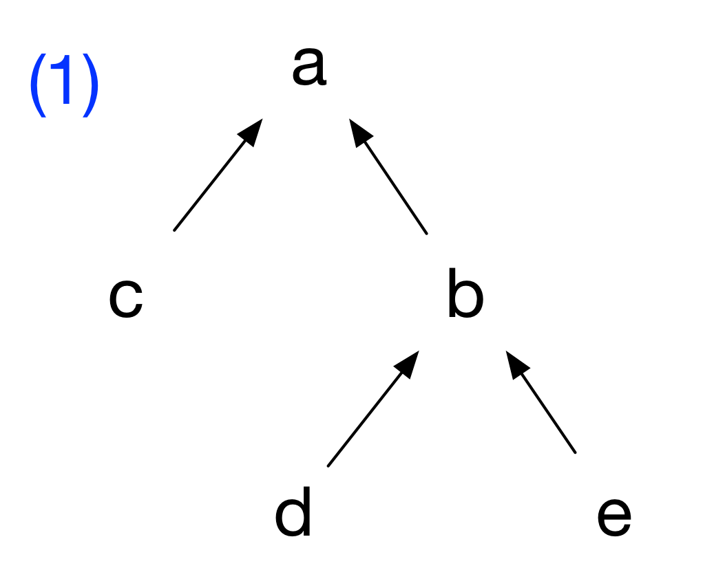
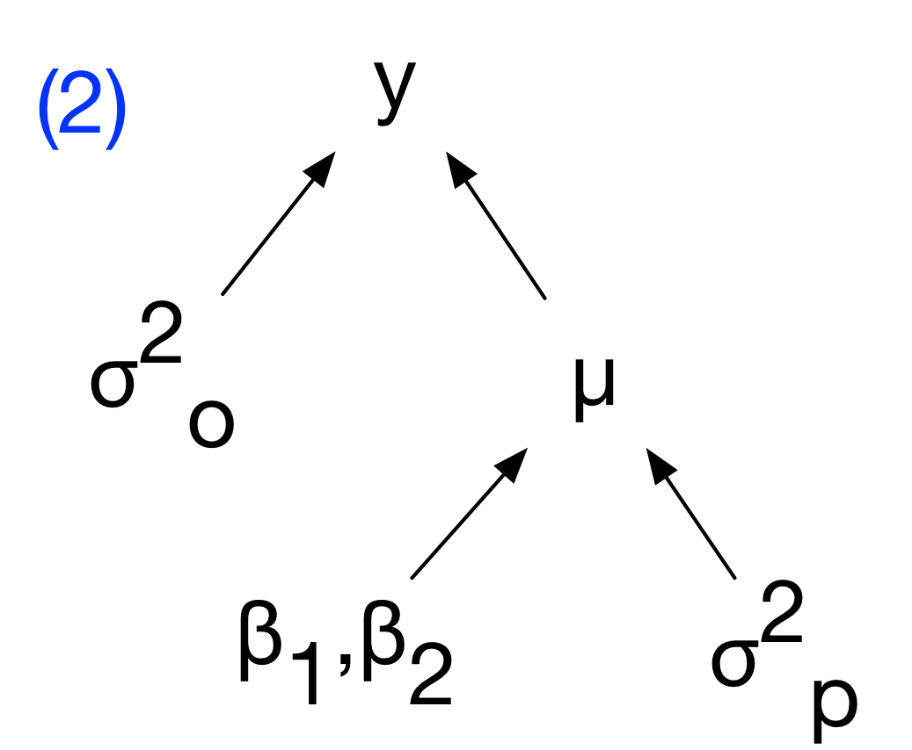
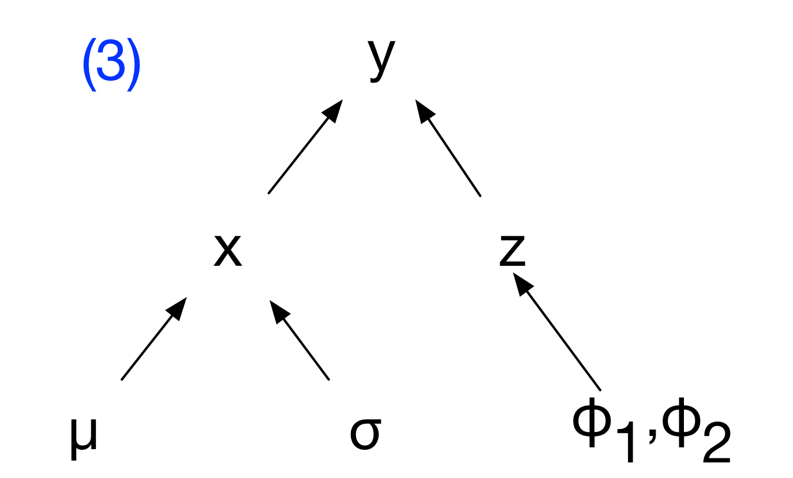
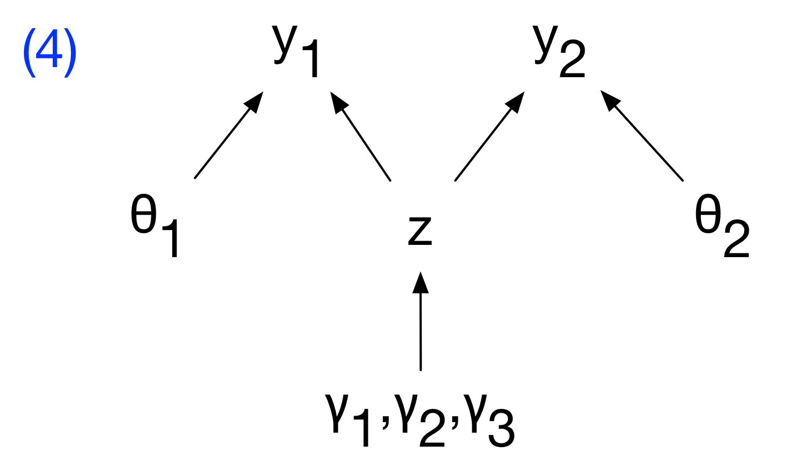
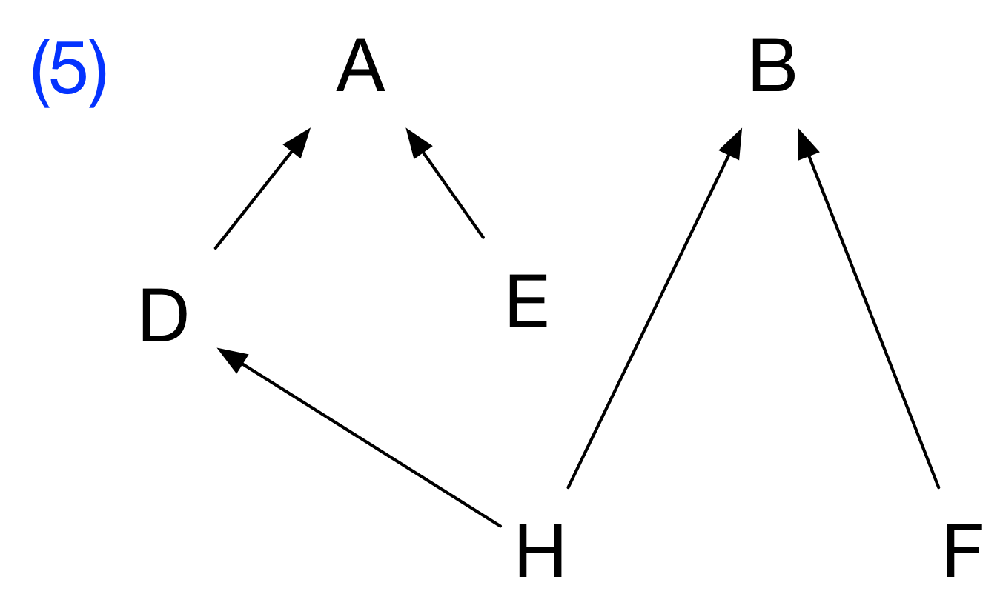
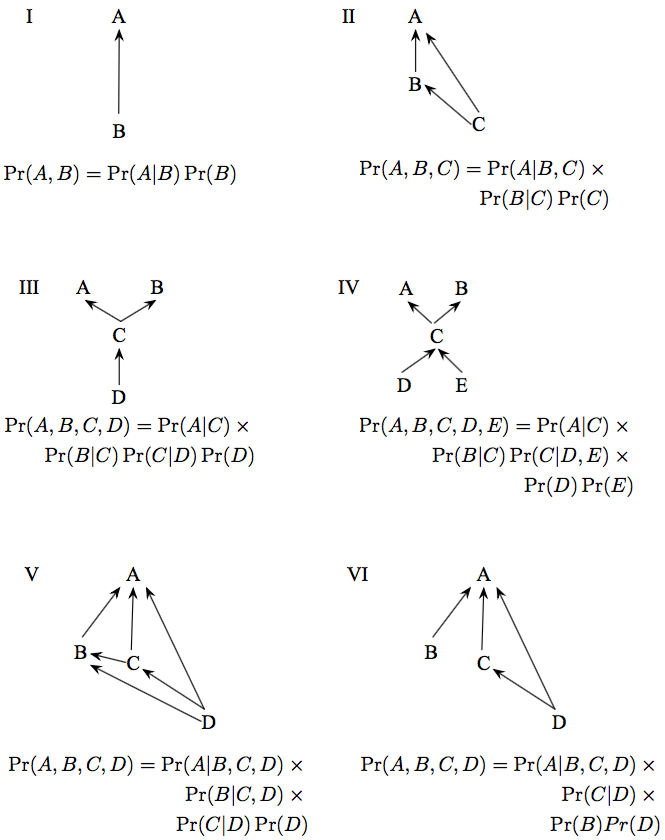

<style>

/* uncomment out this to generate exercise */
 .hider {display: none;}  
 .hider2 {display: inline;} 

/* uncomment out this to generate key */
/* .hider {display: inline;}  
/* .hider2 {display: none;}  

</style>

---
output: html_document
---


### `r fileName="../Title.txt";readChar(fileName,file.info(fileName)$size)`
#### Probability Lab
#### `r format(Sys.Date(), format="%B %d, %Y")`

- - -

#### Table of Contents

[Motivation][]

[Converting DAGs to joint distributions][]

[Converting joint distributions to DAGs][]

[Simplifying][]

[Interpreting and factoring][]

[Diamond's pigeons][]

[Models and Data][]

```{r preliminaries, include = FALSE}
rm(list = ls())
library(knitr)
knitr::opts_chunk$set(cache = FALSE, warnings = FALSE, tidy = FALSE)

# uncomment out this to generate key
# nokey = FALSE; key = TRUE

# uncomment out this to generate exercise
 nokey = TRUE; key = FALSE
```

<br>

#### Motivation

Bayesian analysis is predicated on the idea that we learn about unobserved quantities from quantities we are able to observe.  All observed quantities (i.e. parameters, latent states, missing data and even the data themselves before they are observed) are treated as random variables in the Bayesian approach.  All Bayesian analysis extends from the laws of probability, that is, from the "mathematics of random variables."

Random variables are quantities whose value is determined by chance.  Statistical distributions represent how "chance" works by specifying the probability that a random variable takes on a value (in the discrete case) or falls within a range of values (in the continuous case).  The goal of Bayesian analysis is to discover the characteristics of probability distributions that govern the behavior of random variables of interest, for example, the size of a population, the rate of nitrogen accumulation in a stream, the diversity of plants on a landscape, the change in lifetime income that occurs with changing level of education.

It follows that understanding the laws of probability and statistical distributions provides the foundation for Bayesian analysis. Keep in mind the following learning objectives

- Understand the concepts of conditional and independent random variables.
- Understand discrete and continuous marginal distributions.
- Be able to write out joint distributions of random variables given Bayesian networks (directed acyclic graphs).
- Become familiar with frequently used statistical distributions representing discrete and continuous random variables. 
- Learn R functions for calculating properties of distributions and for sampling from them.
- Use moment matching, a procedure key to linking models to data in the Bayesian framework.

<br>

#### Converting DAGs to joint distributions

Write out the joint and conditional distributions for the following Bayesian networks. For discrete random variables, $\big[A\big]$ is equivalent to $\Pr\big(A\big)$. For continuous random variables $\big[A\big]$ is the probability density of $A$.

<br>




<p style="clear: both;">

<br>



<p style="clear: both;">

<div class="hider">
\begin{eqnarray}
& &\textrm{1.}\quad\big[a,b,c,d,e\big]  = 
\big[a \mid b,c\big]\big[b\mid d,e\big]\big[c\big]\big[d\big]\big[e\big] \\[1em]
& &\textrm{2.}\quad\big[y,\mu,\beta_1,\beta_2,\sigma^2_p,\sigma^2_o\big]  = \big[y\mid \mu,\sigma^2_o\big]\big[\mu\mid \sigma^2_p,\beta_1,\beta_2\big]\big[\sigma^2_p\big]\big[\beta_1\big]\big[\beta_2\big]\big[\sigma^2_o\big]\\[1em]
& &\textrm{3.}\quad\big[y,x,\mu,\phi_1,\phi_2,\sigma \big] = \big[y\mid x, z \big] \big[x \mid \mu, \sigma \big]\big[z \mid \phi_1,\phi_2\big]\big[\sigma\big]\big[\phi_1\big]\big[\phi_2\big]\big[\mu\big]\\[1em]
& &\textrm{4.}\quad\big[y_1,y_2,z,\theta_1,\theta_2,\gamma_1,\gamma_2,\gamma_3\big] = \big[y_1\mid\theta_1,z\big]\big[y_2\mid \theta_2,z\big]\big[z\mid\gamma_1,\gamma_2,\gamma_3\big]\big[\theta_1\big]\big[\theta_2\big]\big[\gamma_1\big]\big[\gamma_2\big]
\big[\gamma_3\big]\\[1em]
& &\textrm{5.}\quad\big[A,B,D,E,F,H\big] = \big[A \mid D,E\,\big]\big[D \mid H\big]\big[B \mid H,F\big]\big[E\big]\big[H\big]\big[F\big]
\end{eqnarray}
</div>

<br>

#### Converting joint distributions to DAGs

Draw Bayesian networks (DAGs) for the joint and conditional distributions below.

\begin{eqnarray}
& &\textrm{I.}\quad \Pr\big(A,B\big)  =  \Pr\big(A\mid B\big)\Pr\big(B\big)\\[1em]
& &\textrm{II.}\quad \Pr\big(A,B,C\big)  =  \Pr\big(A \mid B,C\big)\Pr\big(B\mid C\big)\Pr\big(C\big)\\[1em]
& &\textrm{III.}\quad \Pr\big(A,B,C,D\big)  =  \Pr\big(A \mid C\big)\Pr\big(B \mid C\big)\Pr\big(C \mid D\big)\Pr\big(D\big)\\[1em]
& &\textrm{IV.}\quad \Pr\big(A,B,C,D,E\big)  =  \Pr\big(A \mid C\big)\Pr\big(B\mid C\big)
 \Pr\big(C \mid D,E\big)\Pr\big(D\big)\Pr\big(E\big)\\[1em]
& &\textrm{V.}\quad \Pr\big(A,B,C,D\big)  =  \Pr\big(A \mid B,C,D\big)\Pr\big(B \mid C,D\big)\Pr\big(C \mid D\big),\Pr\big(D\big)\\[1em]
& &\textrm{VI.}\quad \Pr\big(A,B,C,D\big)  =  \Pr\big(A \mid B,C,D\big)\Pr\big(C \mid D\big)\Pr\big(B\big)\Pr\big(D\big)\\[1em]
\end{eqnarray}

<br>

<div class="hider">
<center>

</center>
</div>
  
<br>

#### Simplifying

Simplify the expression below, given that $z_2$ and $z_3$ are independent random variables. 
$$ \Pr\big(z_1,z_2,z_3\big)=\Pr\big(z_1\mid z_2,z_3\big)\Pr\big(z_2 \mid z_3\big)\Pr\big(z_3\big)$$

<div class="hider">
simplifies to 
$$ \Pr\big(z_1,z_2,z_3\big)=\Pr(z_1\mid z_2,z_3\big)\Pr\big(z_2\big)\Pr\big(z_3\big)$$
because $\Pr\big(z_2\mid z_3\big) = \Pr\big(z_2\big)$ if $z_2$ and $z_3$ are independent.
</div>

<br>

#### Interpreting and factoring

The probability of a vector of observations $\mathbf{y}$ depends on a vector of true ecological states of interest, $\mathbf{z}$, and the parameters in a data model: $\boldsymbol{\theta}_{d}$ and $\sigma_{d}$. The probability of the true states $\mathbf{z}$ depends on the parameters in an ecological process model: $\boldsymbol{\theta}_{p}$ and $\sigma_{p}$. We know that $\boldsymbol{\theta}_{d}$, $\boldsymbol{\theta}_{p}$, $\sigma_{p}$, and $\sigma_{d}$ are all independent.  Write out a factored expression for the joint distribution, $\Pr\big(\mathbf{y},\mathbf{z},\boldsymbol{\theta}_{d},\boldsymbol{\theta}_{p}, \sigma_{p}, \sigma_{d}\big)$. Drawing a Bayesian network will help.

<div class="hider">
$$\Pr\big(\mathbf{y},\mathbf{z},\boldsymbol{\theta}_{d},\boldsymbol{\theta}_{p}, \sigma_{p}, \sigma_{d}\big) = 
\Pr\big(\mathbf{y} \mid \mathbf{z},\boldsymbol{\theta}_{d}, \sigma_{d} \big)\Pr\big(\mathbf{z} \mid \boldsymbol{\theta}_{p}, \sigma_{p}\big)
\Pr\big(\boldsymbol{\theta}_{d}\big)\Pr\big(\boldsymbol{\theta}_{p}\big) \Pr\big(\sigma_{d}\big) \Pr\big(\sigma_{p}\big)$$
<div style="width:200px; height=200px; margin:0 auto;">
<center>

</center>
</div>
</div>

<br>

#### Diamond's pigeons

The holy grail in Bayesian analysis is to discover the *marginal posterior distribution* of unobserved quantities (parameters, latent states, missing data, forecasts) from quantities we are able to observe (data).  It follows that we must understand what marginal distributions are.  The following is an example of a discrete case that also exercises your newly gained familiarity with the laws of probability.

Jared Diamond studied the distribution of fruit pigeons *Ptilinopus rivoli* and *P. solomonensis* on 32 islands in the Bismark archipelago northeast of New Guinea (Table 1). Define the event $R$ as an island being occupied by *P. rivoli*, and the event $S$ as an island being occupied by *P. solomonensis*. The complementary events are that an island is not occupied by *P. solomonensis* $\big(S^c\big)$ and not occupied by *P. rivoli* $\big(R^c\big)$.

<br>

<center>
**Table 1**: Data on distribution of species of fruit pigeons on islands

Status  | Number of Islands
------------- | -------------
*P. rivoli* present, *P. solomonensis* absent | 9
*P. solomonensis* present, *P. rivoli* absent | 18
Both present | 2
Both absent | 3
Total | 32
</center>

<br>

1. Fill in Table 2 to estimate the *marginal* probabilities of presence and absence of the two species.  The cells show the joint probability of the events specified in the row and column.  The right column and the bottom row show the marginal probabilities.  

  a.  What is the sum of the marginal rows?
  b.  What is the sum of the marginal columns?
  c.  Why?  Note, when we marginalize over $R$ we are effectively eliminating $S$ and vice versa.

<div class="hider2">

<br>

<center>
**Table 2**: Estimates of marginal probabilities for island occupancy

Events  | $S$ | $S^c$ | Marginal
------------- | ------------- | ------------- | -------------
$R$ | $\Pr\big(S,R\big)=$ | $\Pr\big(S^c, R\big) =$ | $\Pr\big(R\big)=$
$R^c$ | $\Pr\big(S,R^c\big)=$ | $\Pr\big(S^c, R^c\big) =$ | $\Pr\big(R^c\big)=$
Marginal | $\Pr\big(S\big)=$ | $Pr\big(S^c\big)$ | $=$
</center>
</div>

<div class="hider">

<br>

<center>
**Table 2**: Estimates of marginal probabilities for island occupancy

Events  | $S$ | $S^c$ | Marginal
------------- | ------------- | ------------- | -------------
$R$ | $\Pr\big(S,R\big)=\frac{2}{32}$ | $\Pr\big(S^c, R\big) =\frac{9}{32}$ | $\Pr\big(R\big)=\frac{11}{32}$
$R^c$ | $\Pr\big(S,R^c\big)=\frac{18}{32}$ | $\Pr\big(S^c, R^c\big)=\frac{3}{32}$ | $\Pr\big(R^c\big)=\frac{21}{32}$
Marginal | $\Pr\big(S\big)=\frac{20}{32}$ | $Pr\big(S^c\big)=\frac{12}{32}$ | $=\frac{32}{32}$
</center>
</div>

<br>

2. Use the data in Table 1 and the probabilities in Table 2 to illustrate the rule for the union of two events, the probability that an island contains either species, $\Pr\big(R\cup S\big)$. 

<div class="hider">
\begin{eqnarray}
\Pr\big(R\cup S\big) & = & \Pr\big(R\big) + \Pr\big(S\big) - \Pr\big(S,R\big)\\[1em]
\Pr\big(R\big) & = &\frac{11}{32}\\[1em]
\Pr\big(S\big) & = &\frac{20}{32}\\[1em]
\Pr\big(R,S\big) & = &\frac{2}{32}\\[1em]
\Pr\big(R\cup S\big) & = & \frac{11+20-2}{32}  =  \frac{29}{32}\\[1em]
\end{eqnarray}
</div>

3. Use the marginal probabilities in Table 2 to calculate the probability that an island contains both species i.e., $\Pr\big(R,S\big)$, assuming that $R$ and $S$ are independent.  Compare the results from those calculations with the probability that both species occur on an island calculated directly from the data in Table 1. Interpret the results ecologically.  What is $\Pr\big(R\mid S\big)$? What is $\Pr\big(S\mid R\big)$.

<div class="hider">
If the probabilities are independent, then:
$$\Pr\big(R,S\big) = \Pr\big(R\big)\Pr\big(S\big) = \frac{20}{32}\frac{11}{32} = .215$$
</div>

4. Based on the data in Table 1, the probability that an island is occupied by both species is $\frac{2}{32}=.062$. Diamond interpreted this difference as evidence of niche separation resulting for interspecific competition, an interpretation that stimulated a decade of debate.  What are the conditional probabilities, $\Pr\big(R\mid S\big)$ and $\Pr\big(S \mid R\big)$?

<div class="hider">
\begin{eqnarray}
\Pr\big(R \mid S\big) &=& \cfrac{\Pr\big(R,S\big)}{\Pr\big(S\big)}=\cfrac{\frac{2}{32}}{\frac{20}{32}}=.10\\[2em]
\Pr\big(S \mid R\big) &=& \cfrac{\Pr\big(R,S\big)}{\Pr\big(R\big)}=\cfrac{\frac{2}{32}}{\frac{11}{32}}=.18\\[2em]
& & \\[1em]
\end{eqnarray}
</div>

<br>

#### Models and Data

1. We commonly represent the following general framework for linking models to data:

$$\big[y_i \mid g\big(\mathbf\theta,x_i\big),\sigma^2\big],$$

which represents the probability of obtaining the observation $y_i$ given that our model predicts the mean of a distribution $g\big(\mathbf\theta,x_i\big)$ with variance $\sigma^2$.  Assume we have count data.  What distribution would be a logical choice to model these data?  Write out a model for the data.  

<div class="hider">
The Poisson is a logical choice. We predict the mean of the Poisson for each $x_i$, i.e. $\lambda_i = g\big(\mathbf\theta,x_i\big)$, which also controls the uncertainty because in the Poisson distribution the variance equals the mean.  A model for the data is 

$$ y_i \sim \textrm{Poisson}\big(g\big(\mathbf\theta,x_i\big)\big).$$
</div>

<br>

2. Choose the appropriate distribution for the types of data shown below and justify your decision.

* The mass of carbon in above ground biomass in square m plot.
* The number of seals on a haul-out beach in the gulf of AK.
* Presence or absence of an invasive species in forest patches.
* The probability that a white male will vote republican in a presidential election.
* The number of individuals in four mutually exclusive income categories.
* The number of diseased individuals in a sample of 100.
* The political party affiliation (democrat, republican, independent) of a voter. 

<div class="hider">

<br>

<center>
Random variable  | Distribution | Justification 
|------------------------------|-----------------|---------------------------------------------------------
The mass of carbon in above ground biomass in square m plot | gamma or lognormal | continuous and non-negative
The number of seals on a haul-out beach in the gulf of AK | Poisson or negative binomial | counts
Presence or absence of an invasive species in forest patches | Bernoulli | zero or one
The probability that a white male will vote republican in a presidential election | beta | zero to one
The number of individuals in four mutually exclusive income categories | multinomial | counts in more than two categories
The number of diseased individuals in a sample of 100 | binomial | counts in two categories, number of successes on a given number of trials.
The political party affiliation (democrat, republican, independent) of a voter | multinomial | counts in more than two categories
</center>
</div>

<br>

3. Find the mean, variance, and 95% quantiles of 10000 random draws from a Poisson distribution with $\lambda=33.32$.

``` {r, eval = TRUE, echo = key, include = key}
lambda <- 33.32
n <- 10000
y <- rpois(n, lambda)
mean(y)
var(y)
quantile (y, c(0.025, 0.975))
```

<br>

4. Simulate one observation of survey data with five categories on a likert scale, i.e. strongly disagree to strongly agree.  Assume a sample of 80 respondents and the following probabilities:

a.  Strongly disagree = 0.07
b.  Disagree = .13
c.  Neither agree nor disagree = .15
d.  Agree = .23
e.  Strongly agree = .42
    
``` {r, eval = TRUE, echo = key, include = key}

prob <- c(.07,.13,.15,.23,.42)
size <- 80 
n <- 1 
rmultinom(n, size, prob)
```

<br>

5. The average above ground biomass in a 1 km^2^ of sagebrush grassland is 103.4 g/m^2^, with a standard deviation of 23.3. You clip a 1 m^2^ plot. Write out the model for the data.  What is the probability density of an observation of 94 assuming the data are normally distributed? What is the probability that your plot will contain between 90 and 110 gm of biomass? Is there a problem using normal distribution? 

<div class="hider">
$$y \sim \textrm{normal}(103.4, 23.3^{2})$$
</div>

``` {r, eval = TRUE, echo = key, include = key}
x <- 94 
mean <- 103.4
sd <- 23.3
dnorm(x, mean, sd)

q <- c(110, 90) 
p.bound <- pnorm(q, mean = mean, sd = sd)
p.bound[1] - p.bound[2]
```

<div class="hider">
The normal distribution isn't an ideal choice because it extends below 0, which isn't possible for measurements of above ground biomass.
</div>

<br>

6. The prevalence of a disease in a population is the proportion of the population that is infected with the disease. Prevalence of chronic wasting disease in male mule deer on winter range near Fort Collins, CO is 12 percent. A sample of 24 male deer included 4 infected individuals. Write out a model for the data. What is the probability of obtaining these data conditional on the given prevalence (p=0.12)?

<div class="hider">
$$y_i \sim \textrm{binomial}(24, 0.12)$$
</div>

``` {r, eval = TRUE, echo = key, include = key}
x <- 4 
size <- 24
p <- 0.12
dbinom(x, size, p)
```

<br>

7. Researchers know that the true proportion of related age-sex classifications for elk in Rocky Mountain National Park are: *Adult females* (p = 0.56), *Yearling males* (p = 0.06), *Bulls* (p = 0.16), and *Calves* (p = 0.22). What is the probability of obtaining the classification data conditional on the known sex-age population proportions given the following counts?

a.  Adult females (count = 65)
b.  Yearling males (count = 4)
c.  Bulls (count = 25)
d.  Calves (count = 26)

``` {r, eval = TRUE, echo = key, include = key}
p <- c(0.56, 0.06, 0.16, 0.22)
y <- c(65, 4, 25, 26)

dmultinom(x = y, prob = p)
```

<br>

8. Nitrogen fixation by free-living bacteria occurs at a rate of 1.9 g/N/ha/yr with a standard deviation ($\sigma$) of 1.4. What is the lowest fixation rate that exceeds 2.5% of the distribution?  Use a normal distribution for this problem, but discuss why this might not be a good choice. 

``` {r, eval = TRUE, echo = key, include = key}
mu <- 1.9
sigma <- 1.4
p <- 0.025
qnorm(p, mu, sigma)
```

<div class="hider">
The normal distribution isn't an ideal choice because it extends below 0, which isn't possible for measurements of nitrogen fixation.
</div>

<br>

9. You assumed a normal distribution for the earlier above ground biomass problem. Redo the problem with a more appropriate distribution (hint: moment matching required).

<div class="hider">
$$y_i \sim \textrm{gamma}\Big(\cfrac{\mu^2}{\sigma^2},\cfrac{\mu}{\sigma^2}\Big)$$
</div>

``` {r, eval = TRUE, echo = key, include = key}
mu <- 103.4
sd <- 23.2
shape <- mu**2/sd**2
rate <- mu/sd**2
x <- 94
dgamma(x, shape, rate)

q <- c(110, 90)
p.bound <- pgamma(q, shape, rate)
p.bound[1] - p.bound[2]
```

<br>

When we mention *support* we are referring to the range where all probability or probability density values of the random variable being studied are defined as greater than zero.  In the case of the lognormal distribution, which is particularly useful in ecology, its support is continuous and strictly positive.  Moreover, it is often useful because it is asymmetric, allowing for values that are extreme in the positive direction.  Finally, it is useful for representing products of random variables.  The central limit theorem would predict that the distribution of sums of random variables will be normal, no matter how each is individually distributed. Analogously, products of random variables will be lognormally distributed.

10. If a random variable is lognormally distributed then the log of that random variable is normally distributed (conversely, if you exponentiate a normal random variable it generates a lognormal random variable).  The first parameter of the lognormal distribution is the mean of the random variable on the log scale and the second parameter is the variance (or sometimes the standard deviation) of the random variable on the log scale. 

\begin{eqnarray}
z \sim  \textrm{lognormal}\big(\alpha,\beta\big)\\[1em]
\textrm{median}\big(z\big) = e^{\alpha}\\[1em]
\textrm{log}\big(\textrm{median}\big(z\big)\big) = \alpha
\end{eqnarray}

<br>

11. Simulate 10,000 data points from a normal distribution with mean 0 and standard deviation 1 and another 10,000 data points from a log normal distribution with location parameter of 0 and a scale parameter of 1.  Display side-by-side histograms scaled to the density.  Overlay the probability density function.  Find the mean, the median, and the variance of in each case (hint: use moment matching for the lognormal case). Check your estimates empirically with the simulated data. Repeat with different means and standard deviations of your choice.

``` {r, eval = TRUE, echo = key, include = key, fig.width = 10, fig.height = 5, fig.align = 'center'}
par(mfrow=c(1,2))

mean <- 0
sd <- 1
y <- rnorm (10000, mean = mean, sd = sd)
hist(y, breaks = 50, prob = TRUE) 
x  <- seq(-4, 4, .01)
z <- dnorm(x, mean = mean, sd = sd)
lines(x, z, col = "red", lwd = 2)

locationParm <- 0
scaleParm <- 1
log.y <- rlnorm(10000, meanlog = locationParm, sdlog = scaleParm)
hist(log.y, ylim=c(0, .7), breaks = 250, prob = TRUE) 
log.x <- seq(0, 50, .01)
z <- dlnorm(log.x, meanlog = mean, sdlog = sd)
lines(log.x, z, col = "red", lwd = 2)
```

``` {r, eval = TRUE, echo = key, include = key}
median(y)
mean(y)
var(y)

median <- exp(mean)
(mean.log.y <- exp(mean + sd^2/2))
mean(log.y)
(var.log.y <- (exp(sd^2) - 1) * exp(2*mean + sd^2))
var(log.y)
```

<br>

12. Existing literature shows that the probability a habitat patch is occupied by a rare plant (which we define as $\phi$) has a mean of $\mu = 0.04$ with a standard deviation of $\sigma = .01$. Write out a model for the distribution of $\phi$, conditional on $\mu$ and $\sigma$.  

<div class="hider">
$$
\begin{align}
\alpha &=\cfrac{\big(\mu^2 - \mu^3 - \mu\sigma^2\big)}{\sigma^2}\\
\beta &=\cfrac{\big(\mu - 2\mu^2 + \mu^3 - \sigma^2 + \mu\sigma^2\big)}{\sigma^2}\\
\phi &\sim \textrm{beta}\big(\alpha,\beta\big)
\end{align}
$$
</div>

<br>

13. Plot the probability distribution of $\phi$.  
    
``` {r, eval = TRUE, echo = key, include = key, fig.width = 10, fig.height = 5, fig.align = 'center'}

shapeit <- function(mu , sigma){
  a <- (mu^2 - mu^3 - mu * sigma^2)/sigma^2
  b <- (mu - 2 * mu^2 + mu^3 - sigma^2 + mu * sigma^2)/sigma^2
  shape_ps <- c(a, b)
  return(shape_ps)
}

mu <- 0.04
sd <- 0.01

betaParms <- shapeit(mu = mu, sigma = sd)
x <- seq(0, .2, .001)
y <- dbeta(x, betaParms[1], betaParms[2])

plot(x, y,type = 'l', ylab = expression(paste("[",phi,"]")), xlab = expression(phi), 
  xlim = c(0, 0.1), lwd = 2)
```

<br>

14. If you visited 50 patches, what is the probability that 5 would be occupied, conditional on the hypothesis that $\phi=0.04$? 

<div class="hider">
$$\Pr(y=5 \mid \phi, n=50) = \textrm{binomial}\big(y=5\mid \phi=0.04,n=50\big) =\binom{50}{5}0.04^5(1-0.04)^{50-5}$$
</div>

``` {r, eval = TRUE, echo = key, include = key, fig.width = 10, fig.height = 5, fig.align = 'center'}
x <- 5
phi <- 0.04
n <- 50
dbinom(x = x, p = phi, size = n)
```

<br>

15. Plot the probability of the data for y = 1...10 occupied patches out of 50 patches visited conditional on the that hypothesis $\phi=0.04$.

``` {r, eval = TRUE, echo = key, include = key, fig.width = 10, fig.height = 5, fig.align = 'center'}
x <- seq(0, 10)
y <- dbinom(x = x, p = phi, size = n)
plot(x, y, type = 'h', ylab = expression(paste("Pr(y|",phi,")"),), xlab = expression(y), lwd = 3, col = "blue")
```

<br>

16. What is the probability that at least 5 are occupied, conditional on the hypothesis that $\phi=0.04$?  

<div class="hider">
\begin{eqnarray}
\Pr\big(y \geq5 \mid \phi, n=50\big) & = & \textrm{binomial}\big(y \geq5 \mid \phi=0.04,n=50\big)\\[1em]
&= &\sum_{y_{i}\in(5,6,\ldots,50)}\binom{50}{y_{i}}\big(0.04\big)^{\,y_{i}}\big(1-0.04\big)^{50-y_{i}}\\[1em]
\end{eqnarray}
</div>

``` {r, eval = TRUE, echo = key, include = key, fig.width = 10, fig.height = 5, fig.align = 'center'}
q <- 4
phi <- 0.04
n <- 50
(1 - pbinom(q = q, p = phi, size = n))
```

<br>

17. Plot the cumulative probability that at least y = 1...10 patches are occupied, conditional on the hypothesis that $\phi=0.04$?  

``` {r, eval = TRUE, echo = key, include = key, fig.width = 7, fig.height = 5, fig.align = 'center'}
x <- seq(0, 10)
y <- pbinom(q = x, p = phi, size = n)
plot(x, y, ylab = expression(paste("P(",Y <= y," | ",phi,")")), xlab = expression(y), 
  pch = 16, col = "red", cex = 1.5)
```

<br>

18. Simulate data for 75 patches (empty patch = 1, occupied patch = 0).
    
<div class="hider">
$$
y \sim \textrm{binomial}(\phi,1) \equiv y \sim \textrm{Bernoulli}(\phi)
$$
</div>

``` {r, eval = TRUE, echo = key, include = key}
n <- 75
size <- 1
phi <- 0.04
(ySim <- rbinom(n = n, size = size, prob = phi))
```
</div>

<br>

19. You are modeling the relationship between plant growth rate and soil water. Over the range of soil water from 0.01 to 0.2 gm water/gm soil. There is a linear relationship between growth rate and soil water, $\mu_i = \beta_0 + \beta_1x_i$ with $\beta_0 = 0.01$ and $\beta_1 = 0.09$. Write out the model for the data. Simulate a dataset with 20 observations assuming that the $x$ values vary randomly between 0.01 and 0.2 and the standard deviation on the prediction is 0.03.  You must choose a distribution that assures that a of the simulated data are positive. Plot the data and overlay the generating model.

<div class="hider">
\begin{eqnarray}
\mu_i &=& \beta_0 + \beta_1x_1\\
\alpha_i &=& \cfrac{\mu_i^2}{\sigma^2}\\
\beta_i &=& \cfrac{\mu_i}{\sigma^2}\\
y_i &\sim& \textrm{gamma}\big(\alpha_i,\beta_i\big)\\
\end{eqnarray}
</div>

``` {r, eval = TRUE, echo = key, include = key, fig.width = 6, fig.height = 5, fig.align = 'center'}
x <- runif(20, 0.01, 0.2)
mu <- 0.01 + 0.9 * x
sigma <- 0.03
alpha <- mu^2/sigma^2
beta <- mu/sigma^2
y <- rgamma(length(x), alpha, beta)
plot(x, y, xlab = "Soil Moisture", ylab = "Growth Rate", pch = 16, col = "red", cex = 1.5)
lines(x, mu, lwd = 2)
```

<br>

The Poisson distribution is often used for count data, despite the fact that one must assume that the mean and variance are equal. The negative binomial distribution is a more robust alternative, allowing the variance to differ from the mean. There are two parameterizations for the negative binomial.  The first is more frequently used by ecologists: 

$$
\big[z\mid\lambda,r\big] = 
\cfrac{\Gamma\big(z + r\big)}{\Gamma\big(r\big)z!}\Big(\cfrac{r}{r+\lambda}\Big)^r
\Big(\cfrac{\lambda}{r+\lambda}\Big)^z\textrm{,}
$$

where $z$ is a discrete random variable, $\lambda$ is the mean of the distribution and $r$ is the *dispersion parameter*. The variance of $z$ equals $\lambda + \cfrac{\lambda^{2}}{r}$.

The second parameterization is more often implemented in coding environments (i.e. JAGS):

$$
\big[z \mid r,\phi \big] = \cfrac{\Gamma\big(z+r\big)}{\Gamma\big(r\big)z!}\phi^r\big(1-\phi\big)^z\textrm{,}
$$

where $z$ is the discrete random variable representing the number of failures that occur in a sequence of Bernoulli trials before $r$ successes are obtained. The parameter $\phi$ is the probability of success on a given trial. Note that $\phi=\cfrac{r}{\big(\lambda+r\big)}$.

20. Simulate 100,000 observations from a negative binomial distribution with mean of 100 and variance of 400 using the **first** parameterization that has a mean and a dispersion parameter (remember to moment match).

``` {r, eval = TRUE, echo = key, include = key, fig.width = 10, fig.height = 5, fig.align = 'center'}
## r is dispersion called "size" in R
n <- 100000
lambda <- 100
sigma2 <- 400
r <- lambda^2/(sigma2 - lambda)
z1 <- rnbinom(n, mu = lambda, size = r)
mean(z1)
var(z1)
```

21. Do the same simulation using the **second** parameterization. 

``` {r, eval = TRUE, echo = key, include = key, fig.width = 6, fig.height = 5, fig.align = 'center'}
n <- 100000
lambda <- 100
sigma2 <- 400
r <- lambda^2/(sigma2 - lambda)
phi <- r/(r + lambda)
z2 <- rnbinom(n, prob = phi ,size = r)
mean(z2)
var(z2)
```

<div class="hider">
Alternatively,
</div>

``` {r, eval = TRUE, echo = key, include = key, fig.width = 6, fig.height = 5, fig.align = 'center'}
z2 <- rnbinom(n, mu = lambda, size = r)
mean(z2)
var(z2)
```

22. Plot side-by-side histograms of the simulated data.

``` {r, eval = TRUE, echo = key, include = key, fig.width = 8, fig.height = 5, fig.align = 'center'}
par(mfrow = c(1, 2))
hist(z1, col = "gray")
hist(z2, col = "gray")
```

<br>

