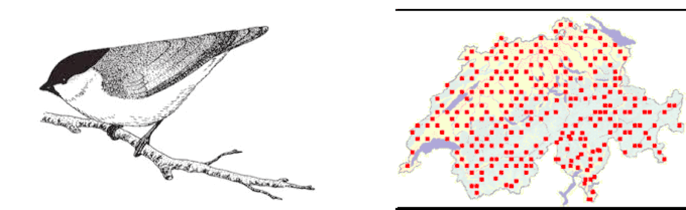

```{r echo=FALSE}
rm(list=ls())
library(knitr)
evalSwitch = FALSE
echoSwitch = FALSE
```

<div style="width:200px; height=200px">

</div>

### `r fileName="../Title.txt";readChar(fileName,file.info(fileName)$size)`

#### Occupancy modeling
#### `r format(Sys.Date(), format="%B %d, %Y")`

#### Motivation
Modeling presence or absence is a classic problem involving mixture models, specifically random variables that are zero-inflated.  Extra zeros are encountered when we model presence or absence because zeros arise from two conditions: truly absent and present but undetected.  This means we need a model for the process that controls occupancy, the true state, and model of the data that accounts for detection.  This is often our starting point in Bayesian analysis-- there a true, unobserved state we seek to understand using a model of a process.  We take imperfect observations on that state and must correct them using a model of the data.

####Problem
A fundamental question in landscape ecology seeks to understand how landscape structure shapes variation in the abundance of species. We will use data from the Swiss Survey of Common Breeding Birds to model habitat occupancy by a common, resident bird in the Swiss Alps, the willow tit (*Parus montanus*). The data come from annual surveys of one km^2^  quadrats distributed across Switzerland (Figure 1). Surveys are conducted during the breeding season on three separate days, but some quadrats have missing data so that the number of replicate observations is fewer than three. During each survey, an observer records every visual or acoustic detection of a breeding species and marks its location using a global positioning system or, in earlier years, a paper map. Because we are observing a resident species during the breeding season, we assume that the true state (occupied or unoccupied) does not change among sample dates, an assumption known as closure. Occupancy data are summarized in the file Occupancy data are found in the file `wtmatrix.csv`. I included some code in the R template to summarize the number of visits and the number of detections. to save you some time. I would be worth it to study the `apply()` function I used to do this if you are not familiar with this very useful function.

<div style="width=2in; height=2in">

</div>
Figure 1. The willow tit (left) is one of 70 bird species that are surveyed annually for abundance in 267 1-km^{2}
  sampling units distributed across Switzerland (right). 

<br> 
We want to understand the influence of forest cover and elevation on the distribution of the willow tit. We have a data (in data frame `obs`) on the number of times a quadrat was searched and the number of times the species was detected. We have covariates on forest canopy cover (% closure, column forest) as well as elevation in meters (column elev) for each quadrat. 

Develop a model of the influence of forest cover and elevation on the distribution of willow tits. Your model should allow estimation of the optimum elevation of willow tit habitat at the mean forest cover, where optimum elevation is defined as the elevation where probability of occupancy is maximum. Diagram the network of knowns and unknowns. Write out a mathematical expression for the posterior and the joint distribution of the data and the parameters. Estimate the posterior distributions of the model parameters using JAGS. Check chains for convergence. 

What can you conclude about the relative importance of elevation and forest cover in controlling the bird's distribution? Plot the probability of occupancy as function of elevation at the mean of forest cover.  Plot a normalized histogram of MCMC output for the optimum elevation at the average forest cover. Overlay 95% credible intervals on the optimum elevation. Your plots should resemble Figure 2 below.

#### Preliminaries
We need to get the data and standardize it.  Note the use of the `scale()` function. The commented code was used to produce the data file you will work with. It woudl be useful to study this code if you are not familiar with the `apply()` function, one of R's most useful tools.
```{r}
library(rjags)

# ##Summarize original data to deal with missing values--not done by students but instructive
# #setwd("/Users/Tom/Documents/Ecological Modeling Course/_A_Master_Lab_Exercises/Swiss breeding birds occupancy model/occupancy lab materials/")
# obs=read.csv("wtmatrix.csv",header=TRUE,sep=",",na.strings=c("NA"))
# obs=obs[,c("y.1","y.2","y.3","elev","forest")]
# y<-as.matrix(obs[,c("y.1","y.2","y.3")])
# n<-apply(!is.na(y),1,sum)  #nice way to sum non missing, n is number of visits
# y<-apply(y,1,sum,na.rm=TRUE) #y is number of times birds were observed
# obs=as.data.frame(cbind(n,y,obs$elev,obs$forest))
# names(obs)=c("number_visits", "number_detections
#write.csv(obs,file="Swiss BB data.csv")


#Student work starts here. Assumes data are in current working directory.
obs=read.csv(file="Swiss BB data.csv")
#create vectors of standardized covariates
elev<-as.vector(scale(obs[,"elev"],center=TRUE))
forest<-as.vector(scale(obs[,"forest"],center=TRUE))
elev2<-elev*elev
M<-nrow(obs)
head(obs)
```
Set up some inits and a data list. Pay attention to the names in the `inits` and the `data` statements to be sure they align with the names you use in the JAGS code.

```{r}
#Make a vector of elevations for predicting occupancy at different elevations.
elev.x=seq(500,2500,100)
data <- list ( y=obs$number_detections,n=obs$number_visits,forest=forest,elev=elev,elev2=elev2, mu.elev=mean(obs$elev), sd.elev=sd(obs$elev),elev.x=elev.x)
#if you use alternate parameterization where b0<-logit(p0), you must remove it from init list
inits= list(
list( z=rep(1,M),p=runif(1), b1=rnorm(1),b2=rnorm(1),b3=rnorm(1)),
list ( z=rep(1,M),p=runif(1), b1=rnorm(1),b2=rnorm(1),b3=rnorm(1)) 
)
```

#### The model
It is your job to fill in the code in the template. There are a couple of alternatives for vague priors on the coefficients.  You might be tempted to use something like `b0 ~ dnorm(0,.0001)` but a better alternative in this case is `b0 ~ dnorm(0, 1/2.25)`. Why is this better?  See Hobbs and Hooten, Section 5.4. 

```{r eval=evalSwitch, echo=echoSwitch}
{  #remember opening and closing bracket for .rmd cat. Not needed by R.
#JAGS code
sink("model.txt")
cat("
      model { 
      	 p~dunif(0,1)
#        b0 ~ dnorm(0,.0001)  
#        b1 ~ dnorm(0,.0001) 
#        b2 ~ dnorm(0,.0001) 
#        b3 ~ dnorm(0,.0001)
       #notice that these give almost identical results and are probably more defensible
       p0 ~ dunif(0,1)   
       b0 <- logit(p0)
       b1 ~ dnorm(0,1/2.25^2) 
       b2 ~ dnorm(0,1/2.25^2) 
       b3 ~ dnorm(0,1/2.25^2) 
        
        #find probablility of occupancy at the average elevation and forest cover
        logit(psi0) <- b0
            for(i in 1:length(y)){ 
           		z[i] ~ dbin(psi[i],1)      
          		logit(psi[i]) <- b0 + b1*elev[i] + b2*elev2[i] + b3*forest[i] 
           		y[i] ~ dbin(z[i]*p,n[i])  
           		y.new[i] ~  dbin(z[i]*p,n[i])  
         } 
        #posterior predictive checks
         mean.y<-mean(y[])
         mean.y.new<-mean(y.new[])
         p.value.mean<-step(mean.y.new-mean.y)
         sd.y<-sd(y[])
         sd.y.new<-sd(y.new[])
         p.value.sd<-step(sd.y.new-sd.y)
              
        
       #estimate optimum elevation at mean forest cover for  scaled values
       elev.xc<- -(1/2)*b1/b2
       #back transform to get elevation in meters
       elev.opt <- elev.xc *sd.elev + mu.elev
       for(j in 1:length(elev.x)){
       	logit(psi.elev[j]) <- b0 + b1*(elev.x[j]-mu.elev)/sd.elev + b2*((elev.x[j]-mu.elev)/sd.elev)^2
		}
     
      }#end of model
",fill=TRUE)
sink()
}
```
Compile the model, get some output, and check for convergence:

#### Output
```{r, eval=evalSwitch, echo=echoSwitch}
parameters <- c("p","b0","b1","b2","b3")
jm=jags.model("model.txt",data=data, inits=inits, n.chains=length(inits), n.adapt=3000)
update(jm,n.iter=5000)
z=coda.samples(jm,variable.names=parameters,n.iter=10000)
summary(z)
#check convergence
plot(z)  #good idea to do this but it makes a file too large for the web site!
gelman.diag(z)
heidel.diag(z)
#JAGS object for plotting and posterior predictive checks.
zj=jags.samples(jm,variable.names=c("psi","psi.elev","elev.opt","p.value.mean", "p.value.sd"),n.iter=10000)
```


Now do the requested plots of 1) probability of occupancy and 2) optimum elevation at the average forest cover using the JAGS object.
```{r, eval=evalSwitch, echo=echoSwitch}
#output derived quantities
par(mfrow=c(1,2))
psi = summary(zj$psi.elev,quantile,c(.025,.5,.975))$stat
plot(elev.x,psi[2,],typ="l",ylim=c(0,1),xlab="Elevation (m)", ylab="Probability of occupancy")
lines(elev.x,psi[1,],typ="l", lty="dashed")
lines(elev.x,psi[3,],typ="l", lty="dashed")
abline(v=1790)
text(1300,.9, "Optimum elevation", cex=.5)

hist(zj$elev.opt, breaks = 300,main="",xlab="Elevation (m)", xlim=c(1500,2500), freq=FALSE)
abline(v=summary(zj$elev.opt,quantile,c(.975))$stat, lty="dashed")
abline(v=summary(zj$elev.opt,quantile,c(.025))$stat, lty="dashed")
```

<div style="width=2in; height=2in">

</div>
Figure 2. Probability of occupancy at the mean forest cover as a function of elevation (left panel) and the posterior density of the optimum elevation at the mean forest cover (right panel). Dashed give are .025 and .975 quantiles, also known as .95 equal-tailed Bayesian credible intervals. 


