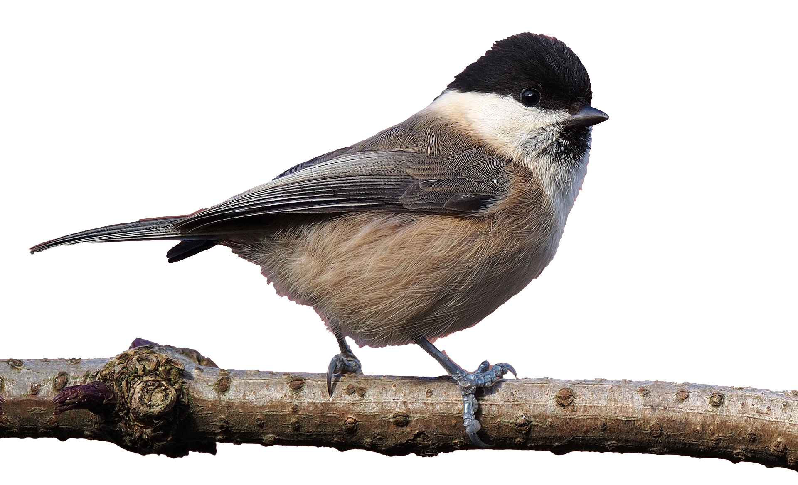

<style>

/* uncomment out this to generate exercise */
/* .hider {display: none;} */

/* uncomment out this to generate key */
  .hider {display: inline;}

</style>

---
output: html_document
---


### `r fileName="../Title.txt";readChar(fileName,file.info(fileName)$size)`
#### Swiss Birds Occupancy Modeling
#### `r format(Sys.Date(), format="%B %d, %Y")`

- - -

#### Table of Contents

[I. Motivation][]

[II. Problem][]

[III. References][]

```{r preliminaries, include = FALSE}
rm(list = ls())
library(knitr)
knitr::opts_chunk$set(cache = FALSE, warnings = FALSE, tidy = FALSE)

# uncomment out this to generate key
 nokey = FALSE; key = TRUE

# uncomment out this to generate exercise
# nokey = TRUE; key = FALSE
```

<br>

#### I. Motivation

Modeling presence or absence is a classic problem involving mixture models, specifically random variables that are zero-inflated. Extra zeros are encountered when we model presence or absence because zeros arise from two conditions: truly absent individuals and individuals present but undetected.  This means we need a model for the process that controls occupancy, the true state, and model of the data that accounts for detection.  This is often our starting point in Bayesian analysis -- there a true, unobserved state we seek to understand using a model of a process.  We take imperfect observations on that state and must correct them using a model of the data.

<br>

#### II. Problem

A fundamental question in landscape ecology seeks to understand how landscape structure shapes variation in the abundance of species. We will use data from the Swiss Survey of Common Breeding Birds, courtesy of Royle and Dorazio (2008), to model habitat occupancy by a common, resident bird in the Swiss Alps, the willow tit (*Parus montanus*). The data come from annual surveys of one km^2^ quadrats distributed across Switzerland (Fig. 1). Surveys are conducted during the breeding season on three separate days, but some quadrats have missing data so that the number of replicate observations is fewer than three. 

During each survey, an observer records every visual or acoustic detection of a breeding species (we do not differentiate between these two types of detections in this problem) and marks its location using a global positioning system or, in earlier years, a paper map. Because we are observing a resident species during the breeding season, we assume that the true state (occupied or unoccupied) does not change among sample dates, an assumption known as closure. 



<p style="clear: both;">

Fig. 1. The willow tit (left, c/o of Francis C. Franklin) is one of 70 bird species that are surveyed annually for abundance in 267 1 km^2^ sampling units distributed across Switzerland (right, c/o the Swiss Ornithological Institute). 

We want to understand the influence of forest cover and elevation on the distribution of the willow tit. The data frame ``SwissBirds`` has the number of times a quadrat (``quadrat``) was searched (``numberVisits``) and the number of times willow tits were detected (``numberDetections``). We have covariates on forest canopy cover (``forestCover``) as well as elevation in meters (``elevation``) for each quadrat surveyed. Develop a model of the influence of forest cover and elevation on the distribution of willow tits. Your model should allow estimation of the optimum elevation of willow tit habitat at the mean forest cover, where optimum elevation is defined as the elevation where probability of occupancy is maximum. 

<br>

1. Diagram the network of knowns and unknowns. 

<div class="hider">
<div style="width:700px; height=700px; margin:0 auto;">

</div>
</div>

2. Write out a mathematical expression for the posterior and the joint distribution. 

<div class="hider">
\begin{eqnarray}
\big[\,\pmb{\beta}, \textbf{z}, p, \mid \textbf{y}] & \propto & 
\prod_{i=1}^{237}\textrm{binomial}\big(y_{i}\mid p \cdot z_{i}, n_{i}\big) 
\textrm{Bernoulli}\big(z_{i} \mid \psi \big) \\
& & \times \prod_{i=1}^{4} \textrm{normal}\big(\beta_{j} \mid 0,.368\big)\textrm{beta}\big(p \mid 1,1\big) \\[1em]
\psi & = & \textrm{logit}^{-1}\big(\,\beta_{1} + \beta_{2}\textrm{elevation}_{i} + 
\beta_{3}\textrm{elevation}_{i}^{2} + \beta_{4}\textrm{forestCover}_{i} \big)
\end{eqnarray}
</div>

3. Estimate the posterior distributions of the model parameters using JAGS. Some hints:

* You will need to standardize the covariates by subtracting the mean and dividing by the standard deviation for each observation in the elevation and forest cover data. Use the ``scale`` function to scale these covariates (this will drastically speed convergence).
* You *must* give initial values of 1 to all unknown 0 or 1 z states.

``` {r, eval = TRUE, echo = key, include = key}
{ # Extra bracket needed only for R markdown files
sink("SwissBirds.R")
cat("
model{ 
  # priors
  p ~ dbeta(1, 1)
  for (i in 1:4){
    beta[i] ~ dnorm(0, .368)  
  }

  # likelihood
  for (i in 1:N){ 
    z[i] ~ dbern(psi[i])      
    logit(psi[i]) <- beta[1] + beta[2]*elevation[i] + beta[3]*elevation[i]^2 + beta[4]*forestCover[i] 
    y[i] ~ dbin(z[i] * p, n[i])  
  } 

  # derived quantities
  elevationMaxScaled <- -beta[2]/(2 * beta[3])
  elevationMax <- elevationMaxScaled * sdElevation + muElevation
  for (j in 1:length(elevationPredict)){
    logit(psiPredict[j]) <- beta[1] + beta[2]*elevationPredict[j] + beta[3]*elevationPredict[j]^2
  }

}
", fill = TRUE)
sink()
} # Extra bracket needed only for R markdown files
```

``` {r, eval = TRUE, echo = key, include = key}
library(SESYNCBayes)
library(rjags)
set.seed(1)

elevation <- scale(SwissBirds$elevation)
muElevation <- mean(SwissBirds$elevation)
sdElevation <- sd(SwissBirds$elevation)
elevationPredict = (seq(500, 2500, 10) - muElevation)/sdElevation

forestCover <- scale(SwissBirds$forestCover)
muforestCover <- mean(SwissBirds$forestCover)
sdforestCover <- sd(SwissBirds$forestCover)

inits = list(
  list(z = rep(1, nrow(SwissBirds)), p = runif(1, 0, 1), beta = runif(4, -2, 2)),
  list(z = rep(1, nrow(SwissBirds)), p = runif(1, 0, 1), beta = runif(4, -2, 2)),
  list(z = rep(1, nrow(SwissBirds)), p = runif(1, 0, 1), beta = runif(4, -2, 2)))

data = list(
  N = nrow(SwissBirds),
  elevation = as.double(elevation),
  forestCover = as.double(forestCover),
  n = as.double(SwissBirds$numberVisits),
  y = as.double(SwissBirds$numberDetections),
  muElevation = as.double(muElevation),
  sdElevation = as.double(sdElevation),
  elevationPredict = as.double(elevationPredict))

n.adapt = 5000
n.update = 10000
n.iter = 10000

jm = jags.model("SwissBirds.R", data = data, inits = inits, n.chains = length(inits), n.adapt = n.adapt)
update(jm, n.iter = n.update)
zm = coda.samples(jm, variable.names = c("p", "beta", "elevationMax"), n.iter = n.iter, n.thin = 1)
zj = jags.samples(jm, variable.names = c("elevationMax", "psiPredict"), n.iter = n.iter, n.thin = 1)
```

4. Summarize the parameters and check chains for convergence. 

``` {r, eval = TRUE, echo = key, include = key}
summary(zm)
plot(zm)
gelman.diag(zm)
heidel.diag(zm)
```

5. What can you conclude about the relative importance of elevation and forest cover in controlling the bird’s distribution? Plot the probability of occupancy as function of elevation at the mean of forest cover. Estimate the optimum elevation of willow tit habitat at the mean forest cover, where optimum elevation is defined as the elevation where probability of occupancy is maximum. Plot a normalized histogram of MCMC output for the optimum elevation at the average forest cover. Overlay 95% credible intervals on the optimum elevation. 

``` {r, eval = TRUE, echo = key, include = key, fig.width = 10, fig.height = 5, fig.align = 'center'}
par(mfrow = c(1, 2))

psi <- summary(zj$psiPredict, quantile, c(.025, .5, .975))$stat
plot(seq(500, 2500, 10), psi[2,], type = "l", ylim = c(0,1), xlab = "Elevation (m)", lwd = 2, 
  ylab ="Probability of occupancy")
lines(seq(500, 2500, 10), psi[1,], type = "l", lty = "dashed", lwd = 2)
lines(seq(500, 2500, 10), psi[3,], type = "l", lty = "dashed", lwd = 2)
abline( v = mean(zj$elevationMax), lwd = 2)
text(1300, .9, "Optimum elevation", cex = .8)

hist(zj$elevationMax, breaks = 500, main = "", xlab = "Elevation (m)", xlim = c(1500, 2500), 
  freq = FALSE, col = "azure1")
abline(v = summary(zj$elevationMax, quantile, c(.975))$stat, lty = "dashed", lwd = 2)
abline(v = summary(zj$elevationMax, quantile, c(.025))$stat, lty = "dashed", lwd = 2)
```

<div class="hider">
Fig.2. Probability of occupancy at the mean forest cover as a function of elevation (left panel) and the posterior density of the optimum elevation at the mean forest cover (right panel). Dashed give are .025 and .975 quantiles, also known as .95 equal-tailed Bayesian credible intervals. 
</div>

```{r echo = FALSE}
unlink("SwissBirds.R", recursive = FALSE, force = FALSE)
```

<br>

#### III. References

Royle, J.A., and R.M. Dorazio. 2008. *Hierarchical Modeling and Inference in Ecology: The Analysis of Data from Populations, Metapopulations, and Communities*. Academic Press, London, United Kingdom.
